## 在虚拟机中安装OPENTHOS
   - [vmware](#vmware)
   - [qemu](#qemu)
   - [virtualbox](#virtualbox)
### vmware

#### 方法一、网盘直接下载，解压使用
1. 百度网盘下载压缩包
```  
链接: https://pan.baidu.com/s/1o9g4KaQ 
密码: 4mjw
```  
2. 解压使用  
注：用vmware workstation或者vmware player(windows) 以及 vmware fusion(mac平台）12.0以上版本直接打开运行

#### 方法二、自己创建虚拟机
1. 下载img镜像
2. 转换镜像格式
   ```qemu-img  convert  -f raw -O vmdk  ./（镜像名字）.img  ./（镜像名字）.img.vmdk```
3. 创建一个虚拟机，向导界面的部分选择如下：
   - 配置类型：典型   
   - 安装来源：稍后安装操作系统   
   - 客户机操作系统：其他   
   - 版本：其他64位   
4. 创建完成后，打开“编辑虚拟机设置”，修改内存大小为4096MB，处理器数量为4。  
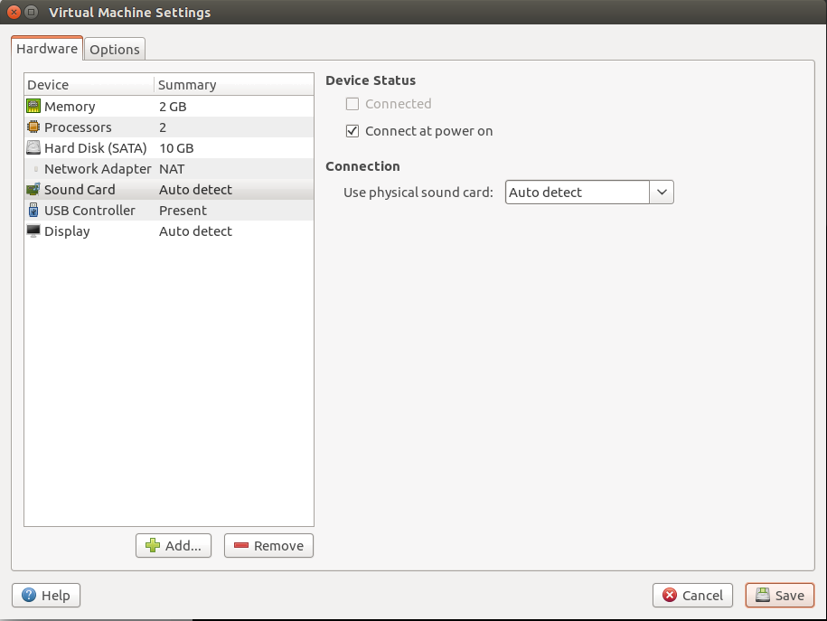

5. Display选项，勾选“Accelerate 3D graphic”  
(若vmware出现“No 3D graphic ...” 错误，可编辑虚拟机文件vmx，加入一行： mks.gl.allowBlacklistedDrivers = "TRUE")  


6. VMware机器设置中，选择“Options“ --> "Advanced"， 勾选"Boot with EFI instead of BIOS";  
（如没有该选项，可编辑虚拟机文件vmx，加入一行：firmware = "efi" ）  


7. 点击设置界面的“添加”按钮，添加一个硬盘挂载vmdk  
硬件类型选择“磁盘”  
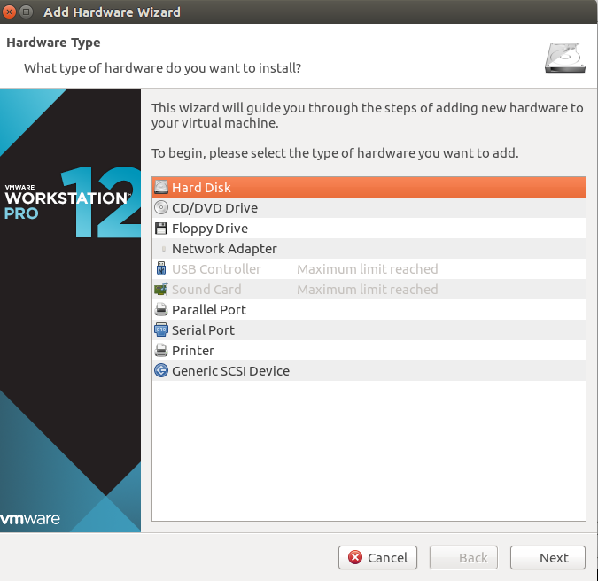  
虚拟磁盘类型选择“IDE”，磁盘选择“使用现有虚拟磁盘”  
  
磁盘文件选择之前转换的vmdk文件，点击完成   
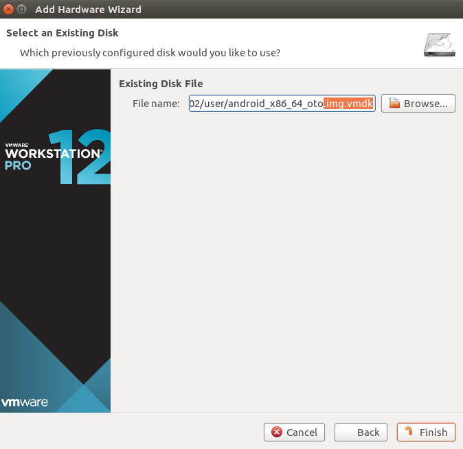  
如果弹出是否保留现有格式的选项，选择“保留现有格式”  


8. 启动后在boto界面（如下图）按F2键  
  
选择“Openthos installation”  
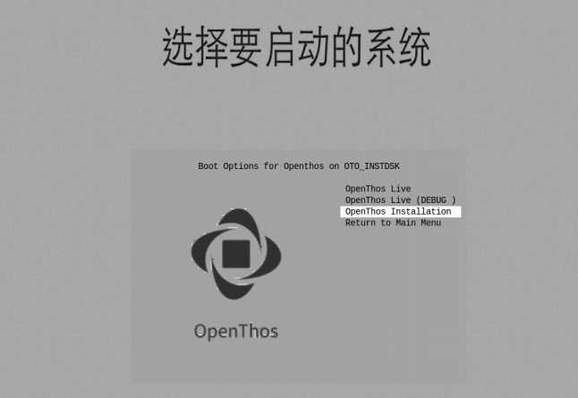  
选择 自动安装  
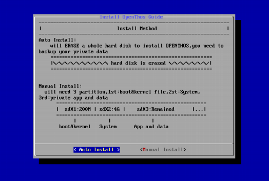  
选择 是  
  
选择一开始创建的那个硬盘  
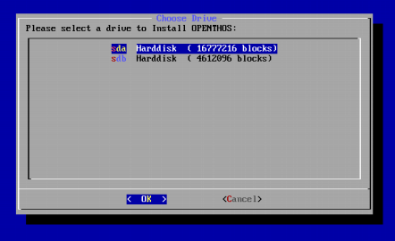

等待，虚拟机重启pan再次进入boto界面，选择左边的Openthos图标进入系统（右边的相当于U盘启动），之后进入[OPENTHOS启动界面](../一.安装.md#启动界面)。  
9. 调整分辨率，默认为1280x720，如果要调到1920x1080修改如下：  
按Alt+F1进入终端，输入```vi /system/build.prop```  
添加```debug.drm.mode.force=1920x1080@60```  
保存后重启虚拟机

### qemu
1. 下载iso或img镜像
2. 创建虚拟磁盘：  
`qemu-img create a.raw +20G`
3. 手动格式化磁盘：  
`parted a.raw`  
```
mklabel msdos
mkpart p ext4 1 20G
quit
```
4. 启动虚拟机
   - 如果是iso镜像　　
      - 默认从cdrom启动：
      `qemu-system-x86_64 -hda a.raw -enable-kvm -m 4096 -cdrom you-download.iso -boot once=d`
      - 启动后选择安装…… 选择第一个安装grub，第二个安装grub2选择skip，其它随意

   - 如果是img镜像，需要以uefi方式启动
      - 下载：https://www.kraxel.org/repos/jenkins/edk2/edk2.git-ovmf-x64-0-20180807.281.gc526dcd40f.noarch.rpm  
      将解压后的usr/share/edk2.git/ovmf-x64目录下的/OVMF-pure-efi.fd复制到a.raw所在的目录
      - 启动虚拟机，默认从hdb启动：
      `qemu-system-x86_64 -bios OVMF-pure-efi.fd -hda q-disk.raw -enable-kvm -m 4096 -smp 4 -hdb xposed_x86_64_oto.img -boot once=d`  
      其中，-smp是处理器个数，推荐设置为4个  
5. 启动后在下图的界面按f2进入选项菜单
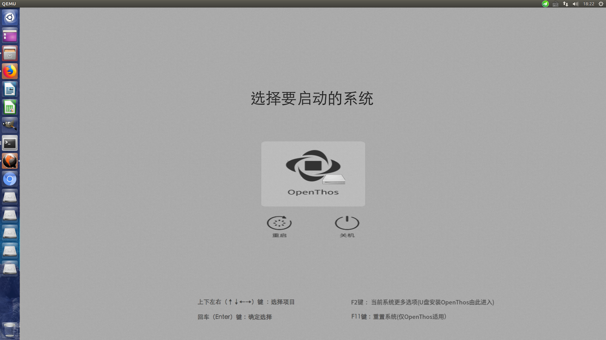
选择安装OPENTHOS
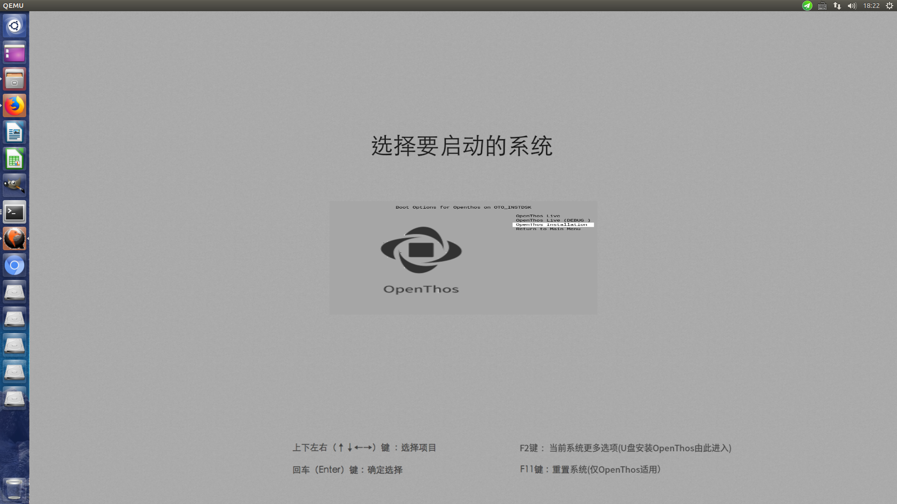
选择自动安装
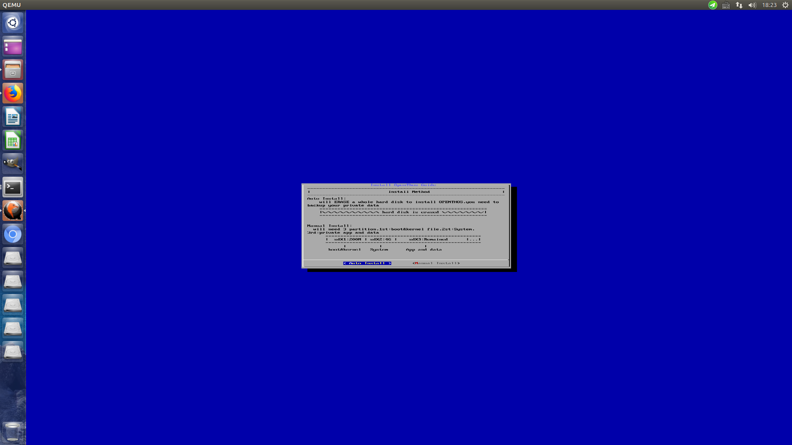
正在安装
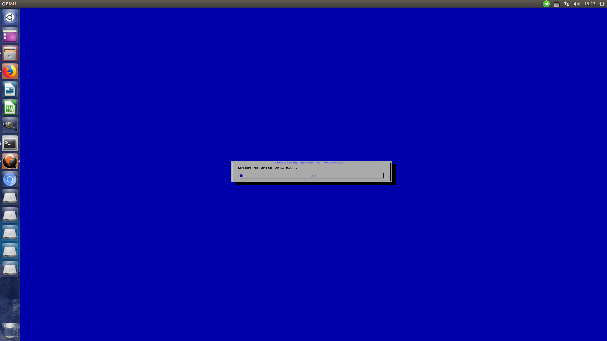
安装完成后会自动重启，之后进入[首次配置](../二.首次配置.md)。
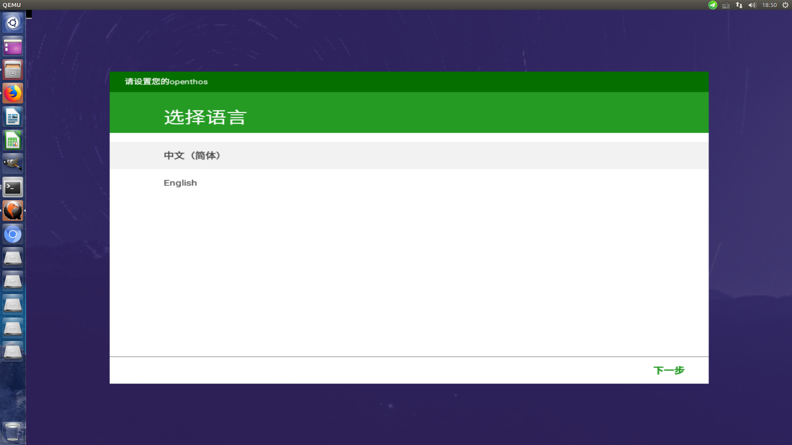

### virtualbox
1. 下载img镜像，转换镜像格式为vmdk，可通过命令行转换：  
`qemu-img  convert  -f raw -O vmdk  ./（镜像名字）.img  ./（镜像名字）.img.vmdk`
2. 启动virtualbox后新建虚拟电脑，类型选Linux，版本选Other Linux(64-bit)，内存４G，之后创建虚拟硬盘(硬盘大小建议>20G)  
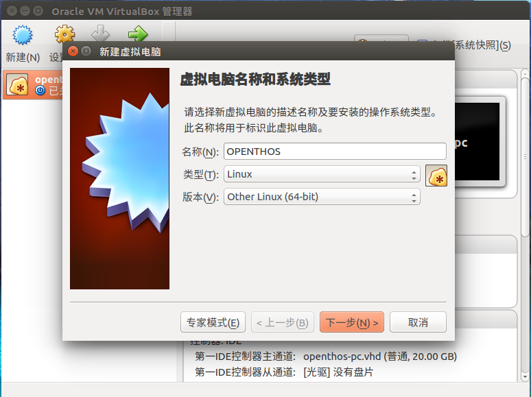  
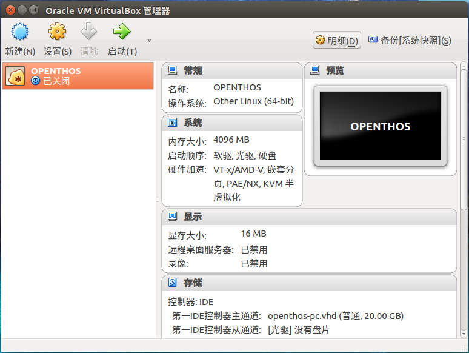
3. 之后点击上方的设置按钮，进入系统选项，勾选“启用EFI”。上方有处理器标签，点进去可以设置处理器，我们是设置的四个，不然会比较慢  
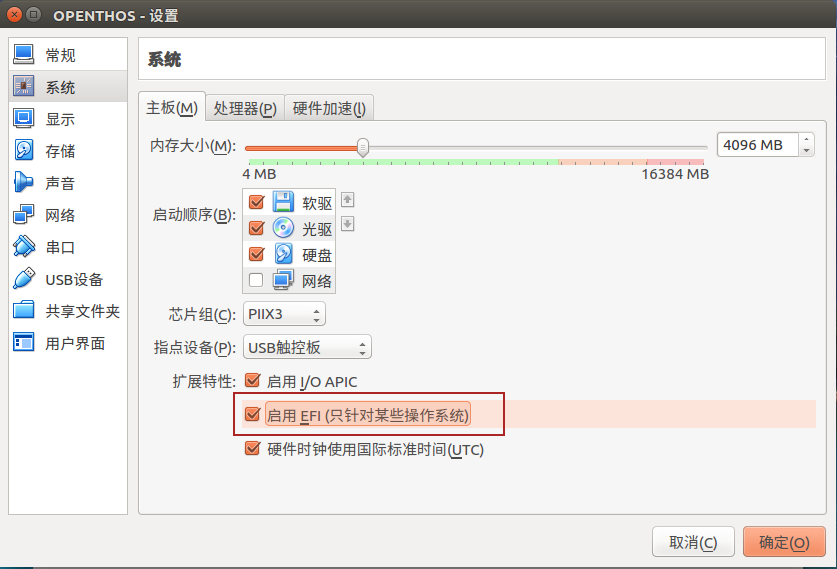
4. 进入存储选项，点击“控制器：IDE“边上的”添加虚拟磁盘“按钮，选择”使用现有的虚拟盘“，选择之前转换的vmdk文件  
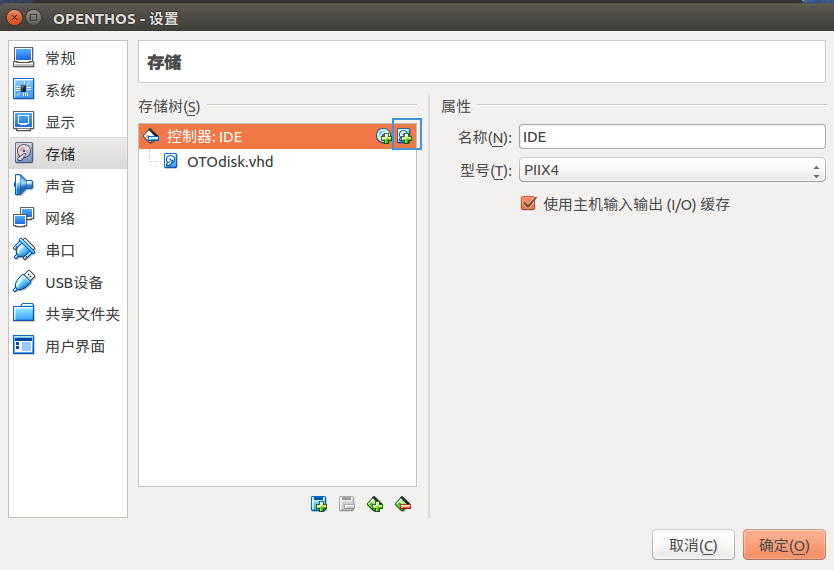  

5. 删掉光盘那项，设置新建虚拟磁盘在”第一IDE控制器主通道“，vmdk文件在”第二IDE控制器主通道“  
6. 完成设置，点击上方”启动“按钮
7. 进入boto界面，如图  
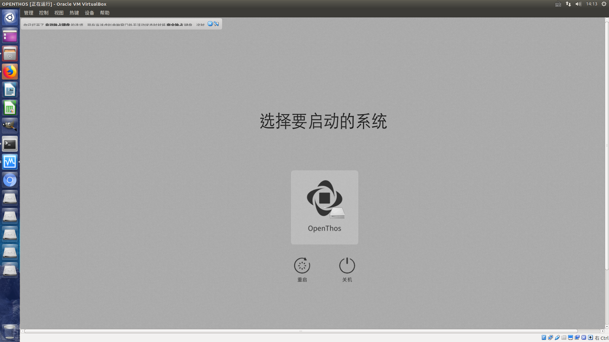  
按f2键进入选项菜单，选择安装OPENTHOS  
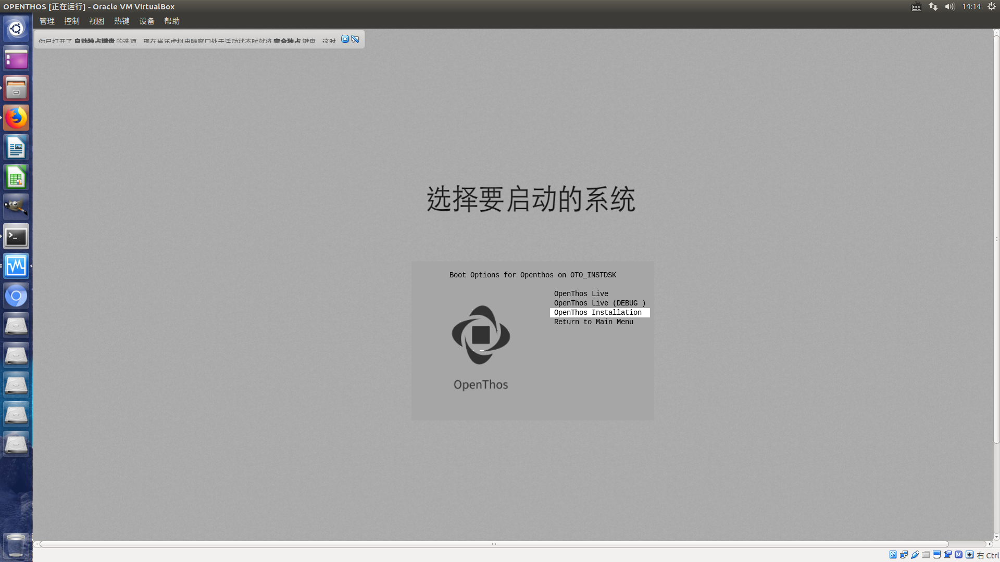  
选择自动安装  
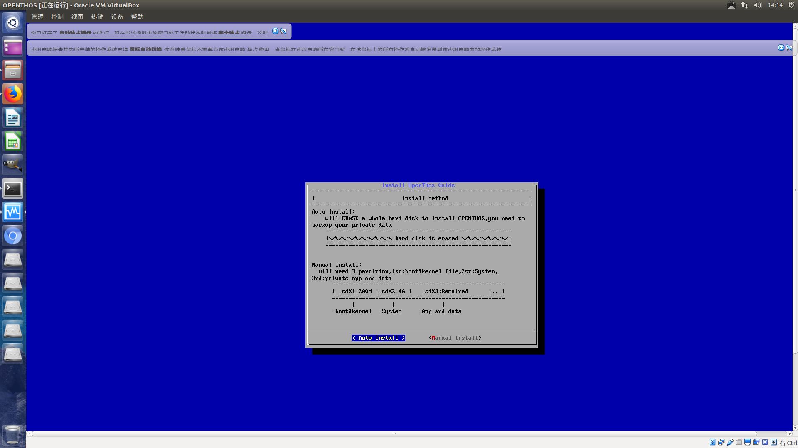  
选“是“
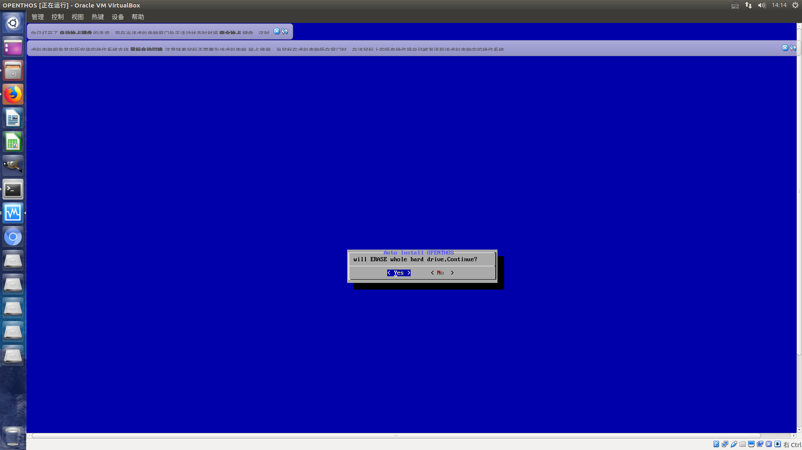  
将OPENTHOS安装到新建的虚拟磁盘中，这里选sda
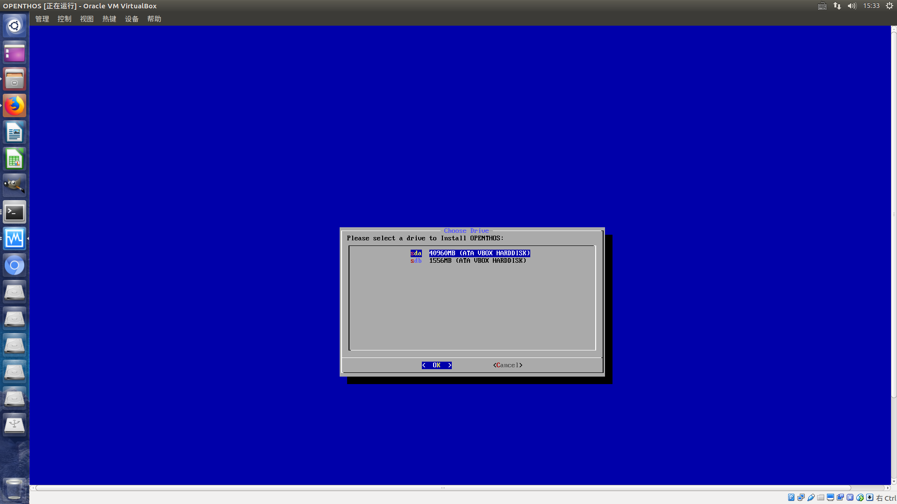
8. 正在安装，需要一些时间，这时可以进入上方菜单的”视图“，选择”自动缩放模式“，将界面调整到合适大小  
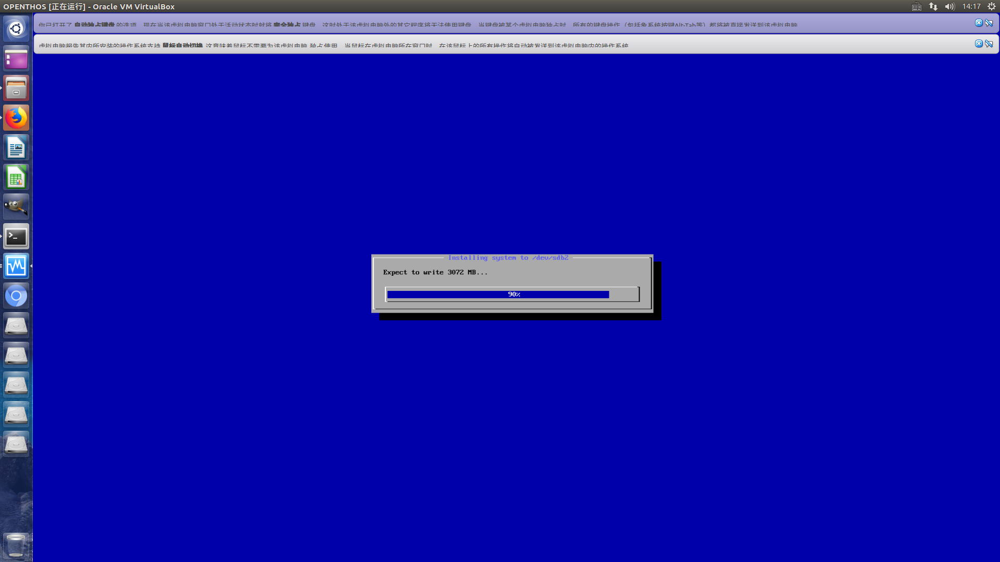
9. 安装完成后会自动重启，重启后在boto界面选择虚拟磁盘的那个启动项，一般左边是sda，右边是sdb，不确定的话可以按f2看菜单，没有安装项的就是虚拟硬盘。之后进入OPENTHOS系统  
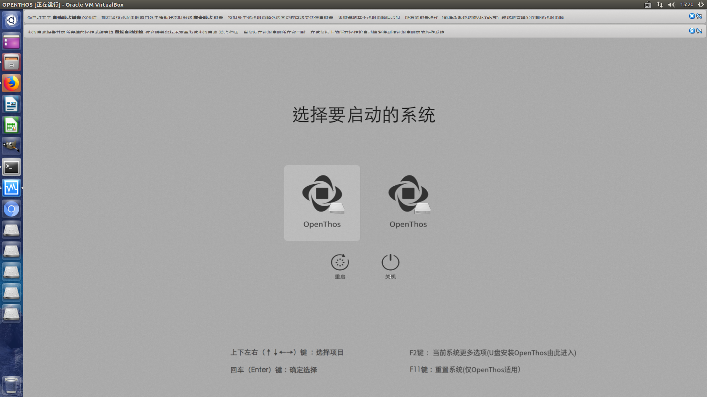
10. 正在启动，之后进入[首次配置](../二.首次配置.md)，如果进来后发现无法操作鼠标，可以通过”右ctrl + c“键唤出菜单，在”热键“选项卡下关掉”鼠标集成“。  
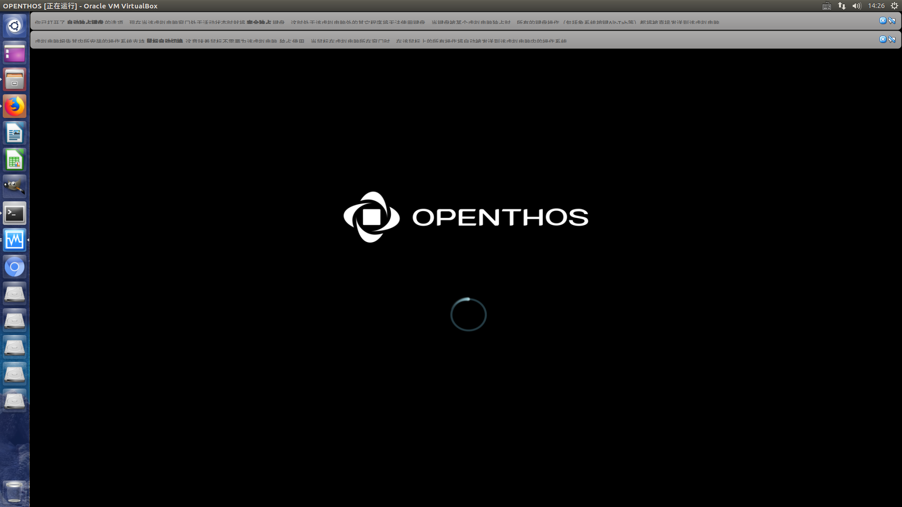  
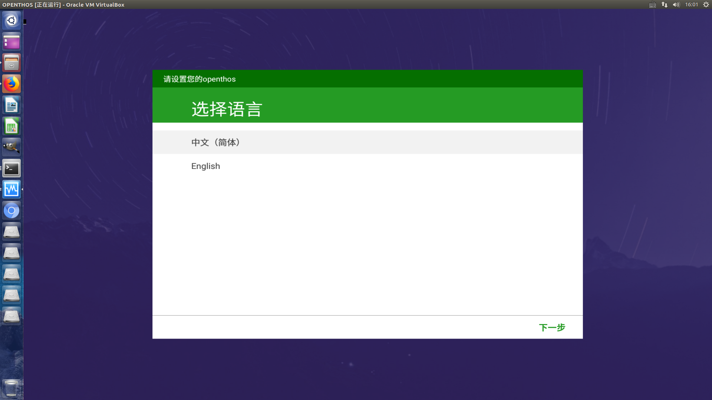
