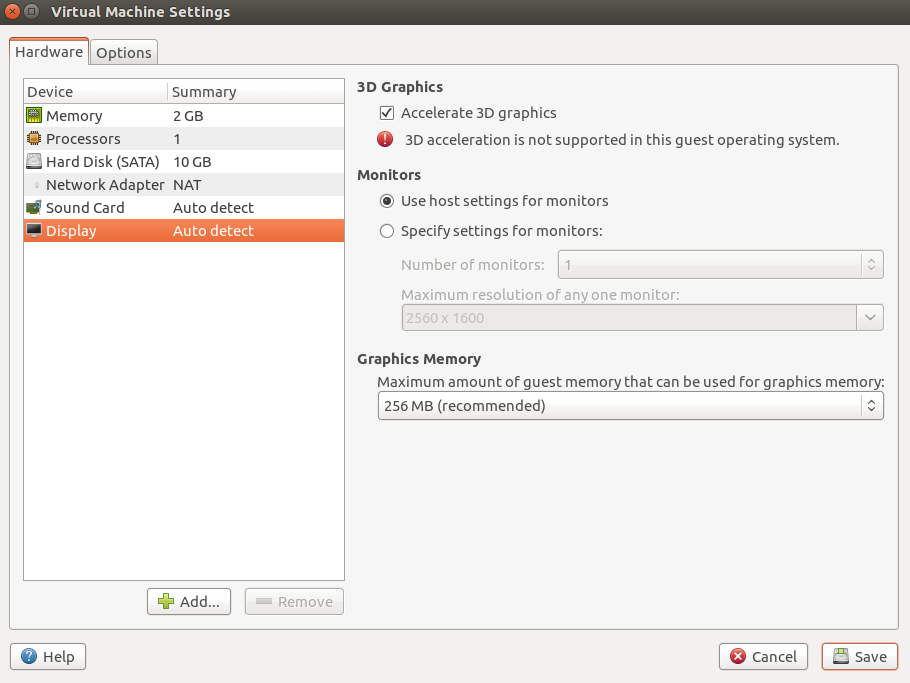
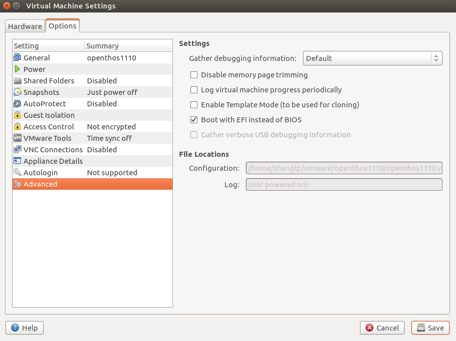
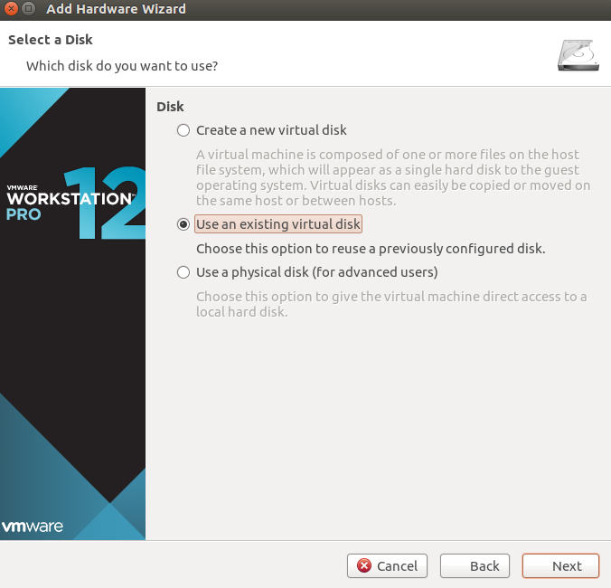
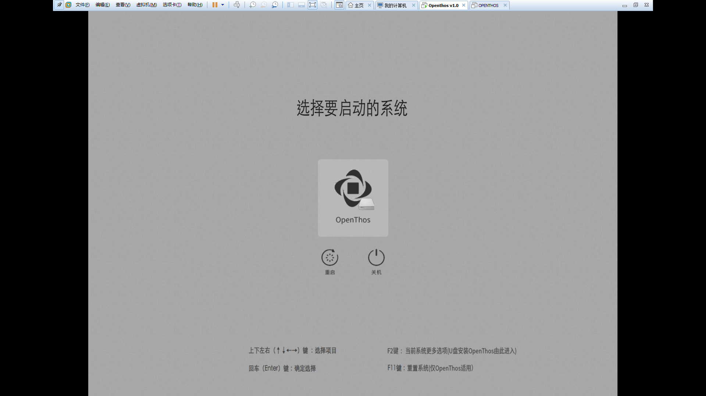

## 在虚拟机中安装openthos

### vmware 虚拟机安装

#### 方法一、网盘直接下载，解压使用
1. 百度网盘下载压缩包
```  
链接: https://pan.baidu.com/s/1o9g4KaQ 
密码: 4mjw
```  
2. 解压使用  
注：用vmware workstation或者vmware player(windows) 以及 vmware fusion(mac平台）12.0以上版本直接打开运行

#### 方法二、自己创建虚拟机
1. 下载img镜像
2. 转换镜像格式
   ```qemu-img  convert  -f raw -O vmdk  ./（镜像名字）.img  ./（镜像名字）.img.vmdk```
3. 创建一个虚拟机，向导界面的部分选择如下：
   - 配置类型：典型   
   - 安装来源：稍后安装操作系统   
   - 客户机操作系统：其他   
   - 版本：其他64位   
4. 创建完成后，打开“编辑虚拟机设置”，修改内存大小为2048MB，处理器数量为2。  

5. Display选项，勾选“Accelerate 3D graphic”  
(若vmware出现“No 3D graphic ...” 错误，可编辑虚拟机文件vmx，加入一行： mks.gl.allowBlacklistedDrivers = "TRUE")  

6. VMware机器设置中，选择“Options“ --> "Advanced"， 勾选"Boot with EFI instead of BIOS";  
（如没有该选项，可编辑虚拟机文件vmx，加入一行：firmware = "efi" ）  

7. 点击设置界面的“添加”按钮，添加一个硬盘挂载vmdk  
硬件类型选择“磁盘”  
  
虚拟磁盘类型选择“IDE”，磁盘选择“使用现有虚拟磁盘”  
  
磁盘文件选择之前转换的vmdk文件，点击完成   
  
如果弹出是否保留现有格式的选项，选择“保留现有格式”  

8. 启动后在boto界面（如下图）按F2键  
  
选择“Openthos installation”  
  
选择 自动安装  
  
选择 是  
  
选择一开始创建的那个硬盘  
  
等待，虚拟机重启后再次进入boto界面，选择左边的Openthos图标进入系统（右边的相当于启动盘），之后进入首次配置，具体说明可参考[首次配置](./三.首次配置.md)
9. 调整分辨率，默认为1280x720，如果要调到1920x1080修改如下：  
按Alt+F1进入终端，输入```vi /system/build.prop```  
添加```debug.drm.mode.force=1920x1080@60```  
保存后重启虚拟机

### qemu 虚拟机安装
1. 下载iso镜像
2. 创建虚拟磁盘：  
    `qemu-img create a.raw +20G`
3. 手动格式化磁盘：  
`parted a.raw`  
```
mklabel msdos
mkpart p ext4 1 20G
quit
```
4. 启动虚拟机，默认从cdrom启动：  
`qemu-system-x86_64 -hda a.raw -enable-kvm -m 2048 -cdrom you-download.iso -boot once=d`  
启动后选择安装…… 选择第一个安装grub，第二个安装grub2选择skip，其它随意
5. 安装后直接虚拟硬盘启动：  
`qemu-system-x86_64 -hda a.raw -enable-kvm -m 2048 -vga cirrus`
