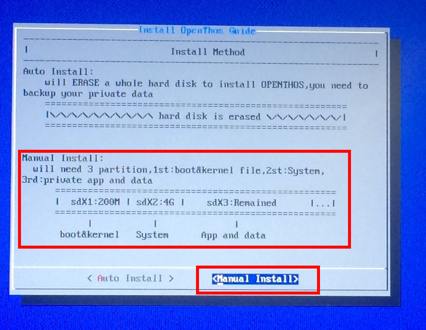
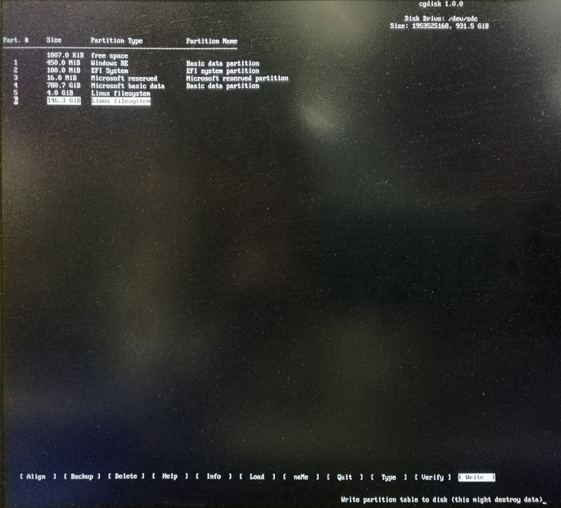
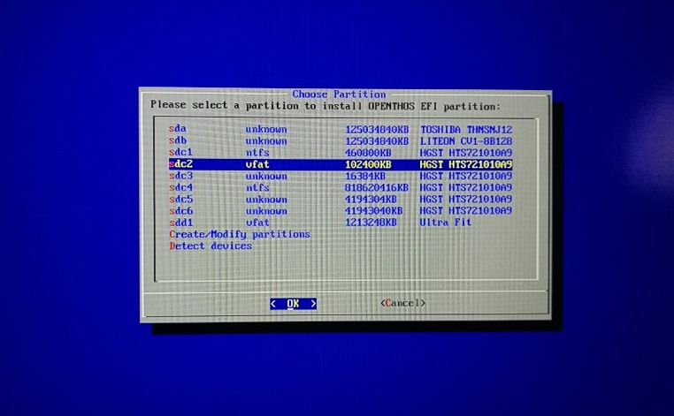
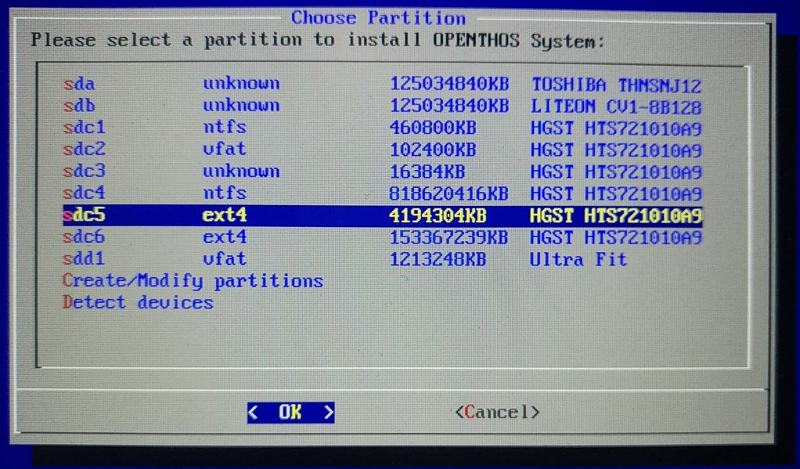
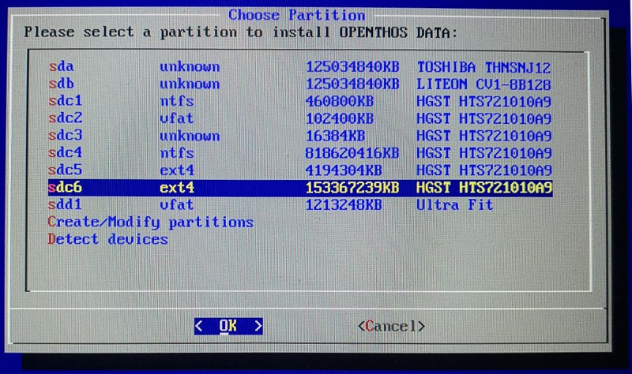
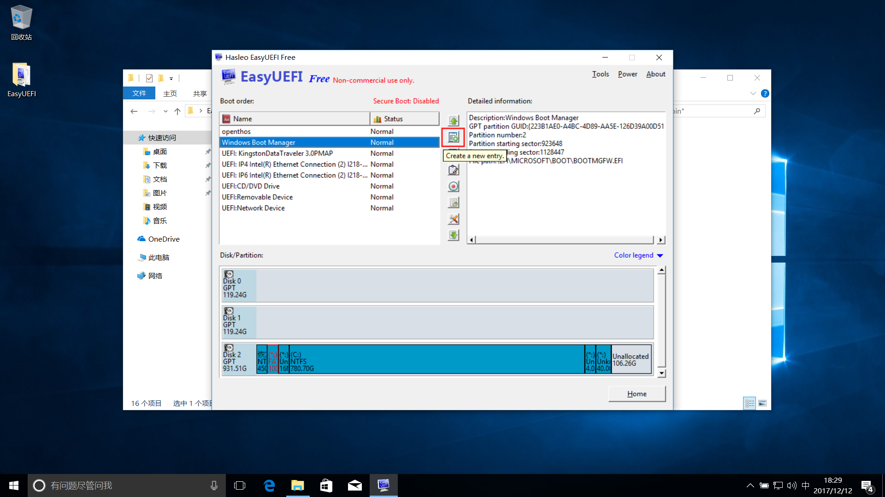
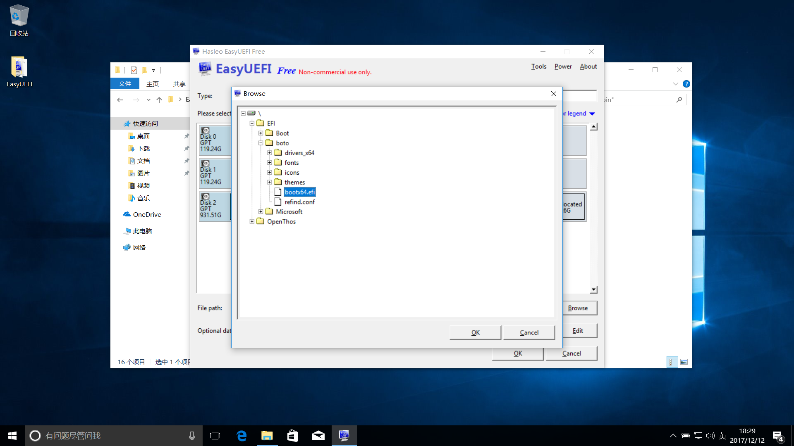
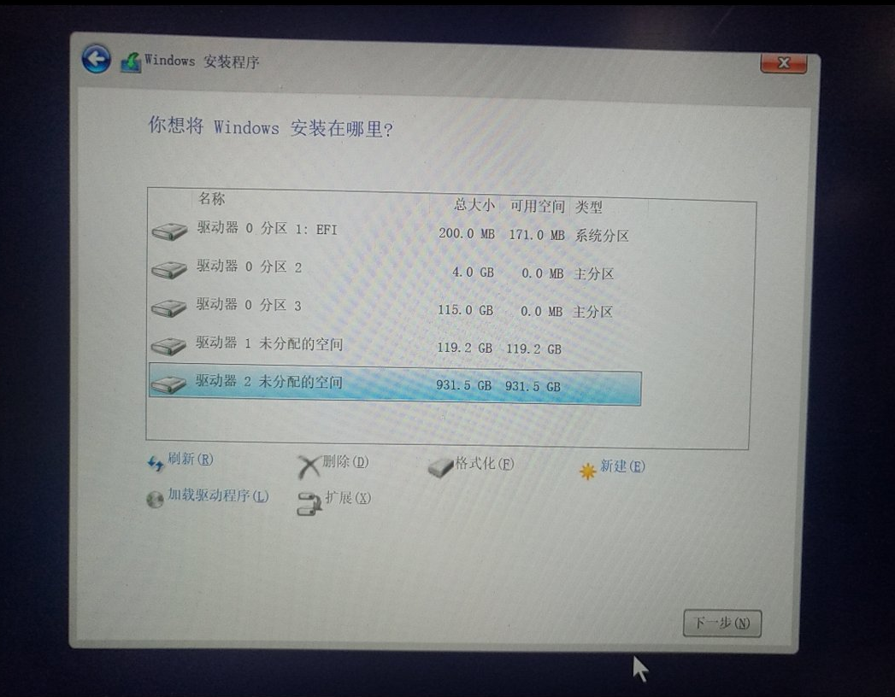
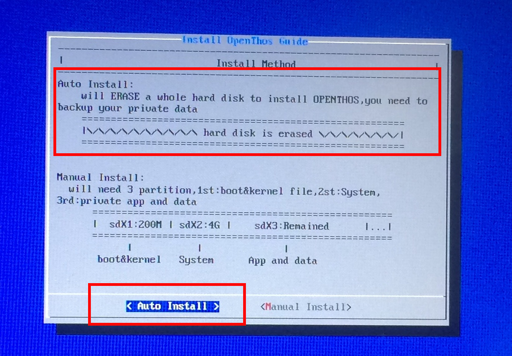
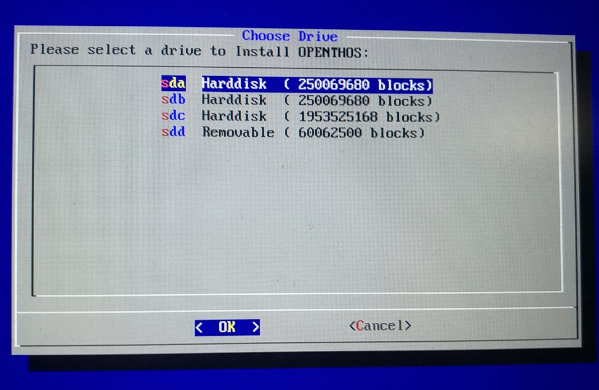

## 安装OPENTHOS和Win10双系统
本文档提供两种安装OPENTHOS和Win10双系统的方法

   - [OPENTHOS和Win10安装在一个硬盘](#openthos和win10安装在一个硬盘)
   - [OPENTHOS和Win10分别安装在两个硬盘](#openthos和win10分别安装在两个硬盘)
   
**注意:win10需要以UEFI模式安装，如果之前已经用bios模式安装了win10,后面的操作可能会导致win10无法启动。如果确认不再使用旧的win10，可以按照下面的步骤重装双系统**
### OPENTHOS和Win10安装在一个硬盘
#### 步骤
1. 开机，进入bios，进入boot标签，选择boot模式为UEFI，保存设置
2. 进入win10启动盘，进入windows安装程序，设置语言等项目，点击下一步，之后点击现在安装
3. 激活windows，或者选择“我没有产品密钥”
4. 选择安装的操作系统，勾选“我接受许可条款”
5. 选择 “自定义：仅安装windows（高级）”
6. 删掉要安装的驱动器的所有分区
7. 选择要安装的分区，点击“新建”按钮，大小随意，但要给OPENTHOS预留至少50G的空间，新建完成后，点击下一步  

8. 等待windows安装完成并重启。
9. 完成windows初始配置后，关闭电脑
10. 插入OPENTHOS启动盘，开机，按F10键显示Boot Menu（Boot Menu的快捷键因电脑而异，可能是F10、F12或其它，请查阅当前电脑的产品手册）  

   
11. 在下图界面中通过方向键选中Openthos的启动盘，之后按F2键(注意不是回车)  

   
12. 选择OpenThos Installation  

   
13. **一定要选择Manual Install**  

   
14. 选择Create/Modify partitions
15. 择要安装的硬盘  

   
16. 选中Free space，下方的光标移动到[new]，开始新建openthos system分区：
      - First sector直接输入回车（设置为默认）
      - Size in sectors输入+4G（分出4G的分区）
      - 剩下的两个选项也直接按回车
17. 选中Free space，下方的光标移动到[new]，开始新建openthos data分区：
      - First sector直接输入回车（设置为默认）
      - Size in sectors直接输入回车（分区大小设置为剩余所有空间）
      - 剩下的两个选项也直接按回车
18. 建好后如下图  
   
19. 下方光标选择[Write]，输入yes按回车，之后下方光标选中[Quit]离开
20. 回到刚才的手动安装界面，开始安装OpenThos的EFI分区。请选择刚才windows装的EFI分区，比如我们在sdc盘安装就是sdc2分区（应该是vfat格式）     
   
21. **系统会提示是否格式化分区，一定要选“no”！！！**
22. 之后开始安装OpenThos系统，选择刚才新建的4G的分区，系统会让你选择文件系统的格式，选择ext4
   
23. 系统提示是否格式化分区选yes
24. 之后开始安装OPENTHOS DATA，选择刚才新建的40G的分区，系统会让你选择文件系统的格式，选择ext4
   
25. 系统提示是否格式化分区选yes
26. 等待系统安装完重启，重启后会自动进入win10
27. 下载EasyUEFI软件，解压后进入bin目录，打开EasyUEFI.exe
28. 进入Manage EFI Boot Option  

29. 左边选择windows boot manager，点击Creat new entry按钮（如图）  

30. Type选”Linux or other OS“，descripion填入“openthos”，target partition选中EFI分区  

31. 点击下方的Browse按钮，选择EFI/boto/bootx64.efi，点OK，点OK  

32. 关闭应用程序，重启电脑，进入BIOS设置，进入Boot标签，Boot Option#1 选择Windows Boot Manager，进入UEFI Hard Disk Drives BBS Priorities，将openthos设置到Boot Option #1，保存并退出  
  

33. 重启后可进入系统选择界面  

   
### OPENTHOS和Win10分别安装在两个硬盘
#### 步骤
1. 开机，进入bios，进入boot标签，选择boot模式为UEFI，保存设置
2. 进入win10启动盘，进入windows安装程序，设置语言等项目，点击下一步，之后点击现在安装
3. 激活windows，或者选择“我没有产品密钥”
4. 选择安装的操作系统，勾选“我接受许可条款”
5. 选择 “自定义：仅安装windows（高级）”
6. 删掉要安装的硬盘的所有分区
7. 选择要安装的硬盘，直接点击下一步  

   
8. 等待windows安装完成并重启。
9. 完成windows初始配置后，关闭电脑
10. 插入OPENTHOS启动盘，开机，按F10键显示Boot Menu（Boot Menu的快捷键因电脑而异，可能是F10、F12或其它，请查阅当前电脑的产品手册）  

   
11. 在下图界面中通过方向键选中Openthos的启动盘，之后按F2键(注意不是回车)  

   
12. 选择OpenThos Installation  

   
13. 选择auto install  

   
14. 系统提示后续操作将会有格式化硬盘的操作，选择yes（只格式化下一步选中的硬盘，不会动其它硬盘）  

   
15. 选择一个要安装openthos的硬盘（将会格式化此硬盘，请先确保硬盘没有其它要用的系统）  

   
16. 等待openthos安装完毕并重启
17. 重启时进入BIOS设置，进入Boot标签，Boot Option#1 选择Windows Boot Manager，进入UEFI Hard Disk Drives BBS Priorities，将openthos设置到Boot Option #1，保存并退出  
  

   
18. 重启后可进入系统选择界面  

