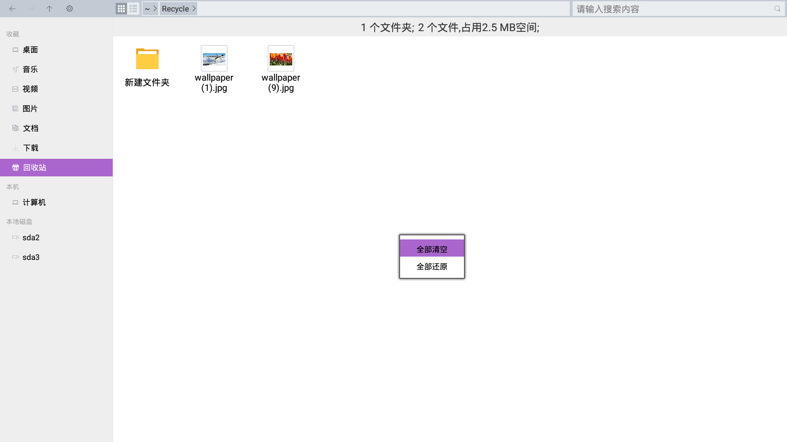

## OPENTHOS 文件管理器

### 目录
   - [浏览](../soft/浏览文件或文件夹.md)
   - [删除](../soft/删除文件或文件夹.md)
   - [复制或移动](../soft/复制和移动文件或文件夹.md)
   - [对文件和文件夹排序](../soft/对文件和文件夹进行排序.md)
   - [搜索文件](../soft/搜索文件.md)
   - [重命名](../soft/重命名文件或文件夹.md)
   - [框选文件](../soft/框选文件.md)
   - [压缩软件](../soft/压缩软件.md)
   - [云服务](../soft/云服务.md)
   - [网上邻居](../soft/网上邻居.md)
   - [使用其他应用程序打开文件](../soft/使用其他应用程序打开文件.md)
   - [寻找丢失的文件](../soft/寻找丢失的文件.md)
   - [文件属性](../soft/文件属性.md)  
   - [安全删除外部设备](../soft/安全删除外部设备.md)  
   - [文件管理器功能点](../soft/点此查看功能点.md)

### 浏览文件和文件夹
   - 您可以用文件管理器浏览和组织您电脑上的文件或管理本地存储设备（如外置硬盘）、云服务和网络共享上的文件
   - 要启动文件管理器，您可以在桌面打开我的电脑。您也可以点击任务栏或开始菜单中的文件管理器快捷图标
   - 双击查看文件夹  
   在文件管理器中，双击任何文件夹查看其内容。双击文件，使用文件的默认应用程序打开它。
   - 右键查看文件夹  
   您也可以右键点击一个文件或文件夹打开它。  
   
   - 文件夹显示路径  
   文件和文件夹列表上方的路径栏显示您正在查看的文件夹，其中包括最高可至主目录、可移动设备根目录或文件系统根目录的父文件夹。  
   
   - 点击地址栏按钮查看上级目录  
   您也可以点击地址栏上的路径按钮来跳转到相应的上级目录。  
   - 快速查看常用位置／个人空间  
   您可以快速地从侧边栏访问常用的位置。也可以进入个人空间访问常用的位置。
    
   

### 删除文件和文件夹
#### 要将文件移动到回收站
   - 删除项目  
   单击您想要删除的项目，按键盘上的 Delete 键。或者，在右键菜单中选择删除  
     
   在弹出的对话框中选择确认删除或者取消操作
   
   - 已删除项目  
   在回收站中可以查看到您删除的文件  
   
#### 回收站文件还原
   - 您可以将回收站的文件还原至之前的目录  
   单击您想要还原的项目，在右键菜单中选择还原

   - 您也可以将回收站的文件全部还原至之前的目录  
   在空白处弹出右键菜单，选择全部还原

#### 回收站文件清空
   - 您可以将回收站的文件删除（清空）  

      - 单击您想要删除的项目
      - 在右键菜单中选择删除
   - 您也可以将回收站的文件全部删除（清空）  
   
   
      - 在空白处弹出右键菜单，选择全部清空

#### 永久删除文件
   - 您可以立即永久删除一个文件，而无需将其先放进回收站  
   

      - 选择您想要删除的项目
      - 按住 Shift 键，然后按键盘上的 Delete 键；或者在右键菜单中选择永久删除
      - 由于您无法取消此操作，因此会要求您确认是否确实要删除文件或文件夹
