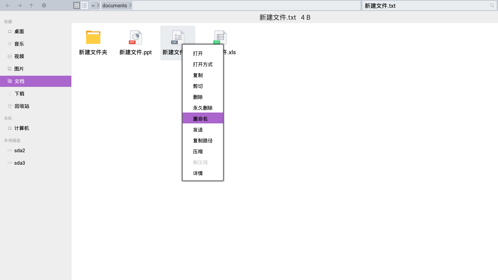

# 重命名文件或文件夹

- 您可以使用文件管理器来为文件和文件夹进行重命名。

***
## 重命名文件或文件夹

- 1.锁定目标文件或文件夹

  - 右击文件或文件夹，然后选择重命名，或选择文件，然后按 F2 键。

- 2.进行重命名

  - 在弹出的对话框中输入新名称，然后按回车键。或者点击确定按钮。
  - 默认不选中文件后缀名称

***
## 常见问题

**1、该名称已被使用**

- 在同一文件夹中不能有两个文件或文件夹使用同一名称。如果您尝试将文件重命名为您所在文件夹中已存在的名称，文件管理器将不允许该操作。

  - 提示：重命名失败，可能使用该名称的文件或文件夹已存在。
  - 避免方式：使用不同的名称。

- 文件和文件夹名称目前不能区分大小写。例如，File.txt 和 file.txt 会被识别为同一个文件。所以同样会提示重命名失败

**2、文件名称过长**

- 在一些文件系统中，文件名不能超过255个字符，这255个字符数限制同时存在于文件名和文件路径中，因此您应该尽可能避免过长的文件和文件夹名。

  - 目前存在问题：文件名过长会有提示，但是提示不正确。目前使用重命名失败的提示信息
