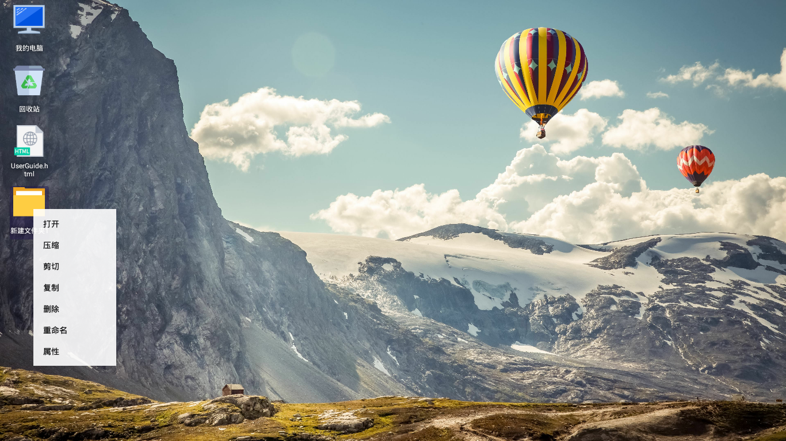
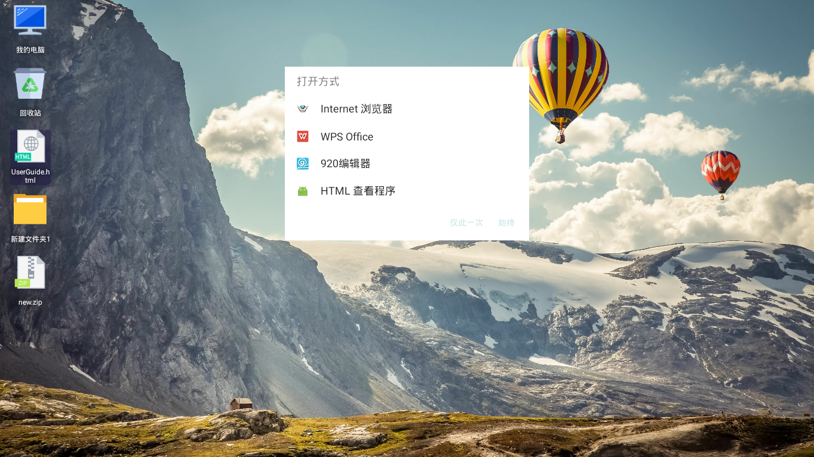
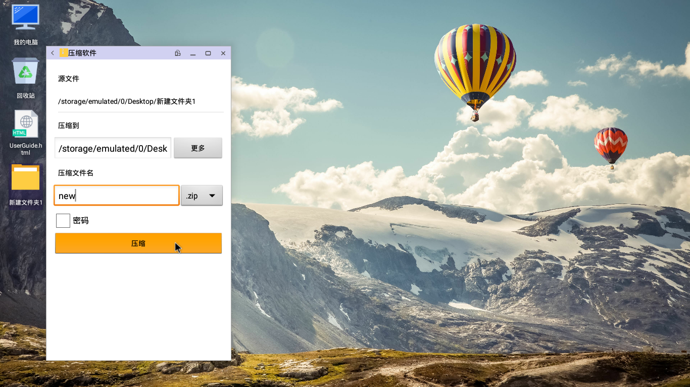
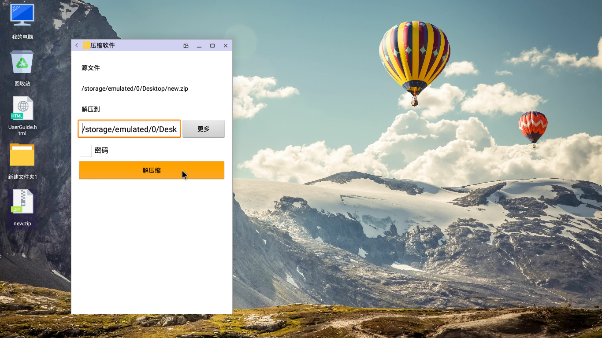

## 文件夹/文件
   - 鼠标左键单击 --（反白）
   - 鼠标左键双击文件夹 --（打开文件管理器且显示相应的文件夹）
   - 鼠标左键双击文件 --（以系统已有的应用打开文件）
   - 鼠标右键打开选项菜单）  


      - 打开
      - 打开方式 --（列出可打开该文件格式的应用）  

      - 压缩 --（弹出压缩格式选择窗口）  

    ```
    默认压缩为zip格式，文件可以压缩成zip、7z和tar三种格式，tar可以再次压缩成tar.gz和tar.bz2格式，zip格式不允许再次压缩
    ```
      - 解压缩 --（快速解压缩）  
也可以通过双击压缩包打开压缩软件的方式编辑和解压文件，具体操作请见[压缩软件](../soft/压缩软件.md)  

      - 剪切 --（将该文件记录，以便之后用于粘贴，支持去文件管理器粘贴）
      - 复制 --（将该文件记录，以便之后用于粘贴，支持去文件管理器粘贴）
      - 删除 --（弹出删除到回收站的弹窗）
         - 是 --（删除该文件到回收站）
         - 否 --（取消该操作）
      - 重命名 --（文件名获得焦点，可以输入文字，按回车键或者点击桌面其他位置确定重命名）
    ```
    如果不能重命名，可能是因为有应用在前台可见，需要点击右下角回到桌面或者直接win+d回到桌面后点击方可生效
    ```
      - 属性 --（弹出属性弹窗）
         - 文件类型 --（显示文件类型，暂不支持）
         - 打开方式 --（显示打开方式，暂不支持）
         - 位置 --（显示文件的绝对路径）
         - 大小 --（显示文件的大小）
         - 创建时间 --（显示文件的创建时间）
         - 修改时间 --（显示文件的修改时间）
         - 访问时间 --（显示文件的访问时间）
         - 用户权限 --（显示文件的用户权限）
         - 群组权限 --（显示文件的群组权限）
         - 其他权限 --（显示文件的其他权限）
         - 确定 --（关闭该弹窗）
         - 取消 --（关闭该弹窗）
         - 应用 --（关闭该弹窗）
