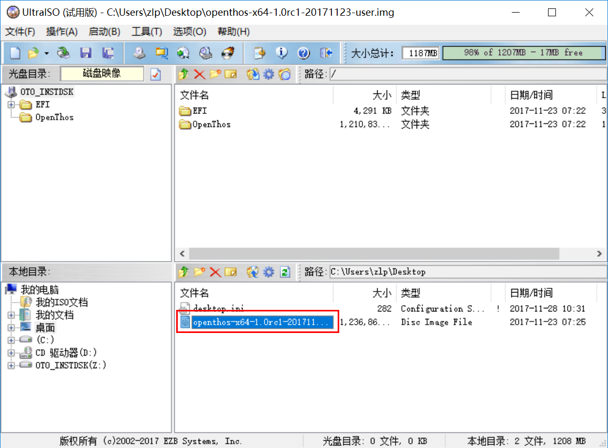
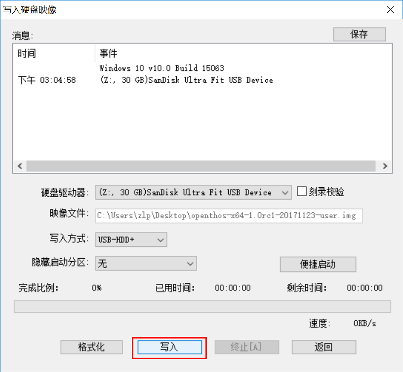
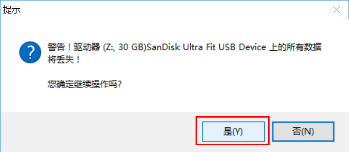
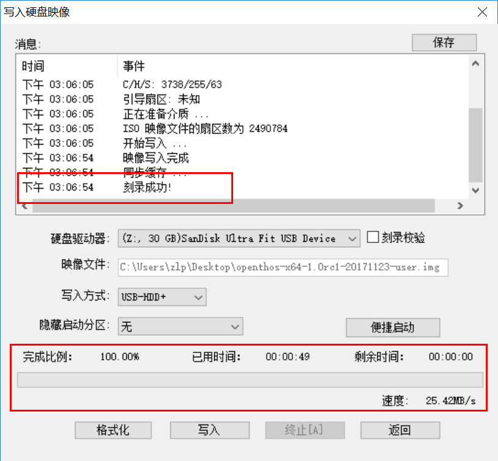
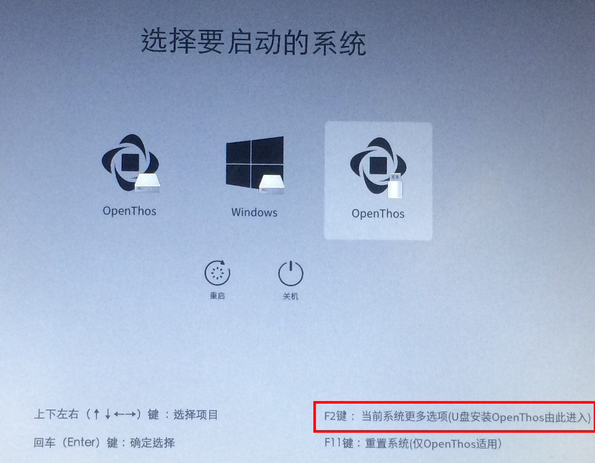
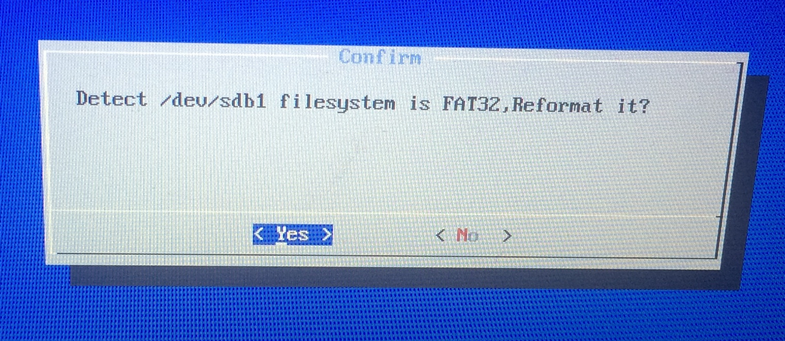
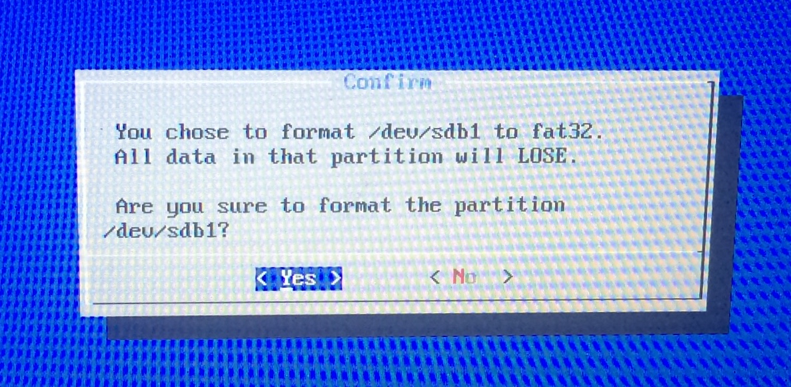
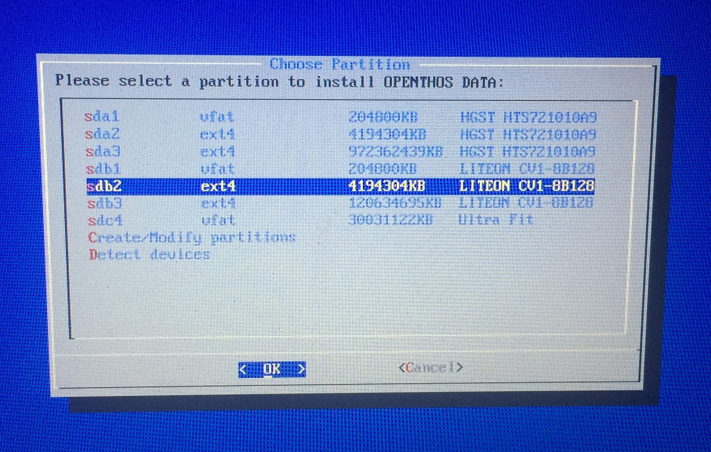
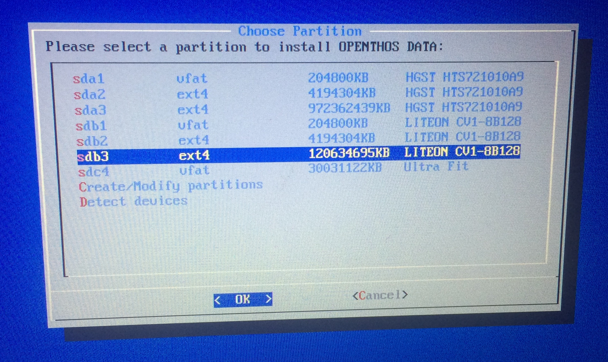
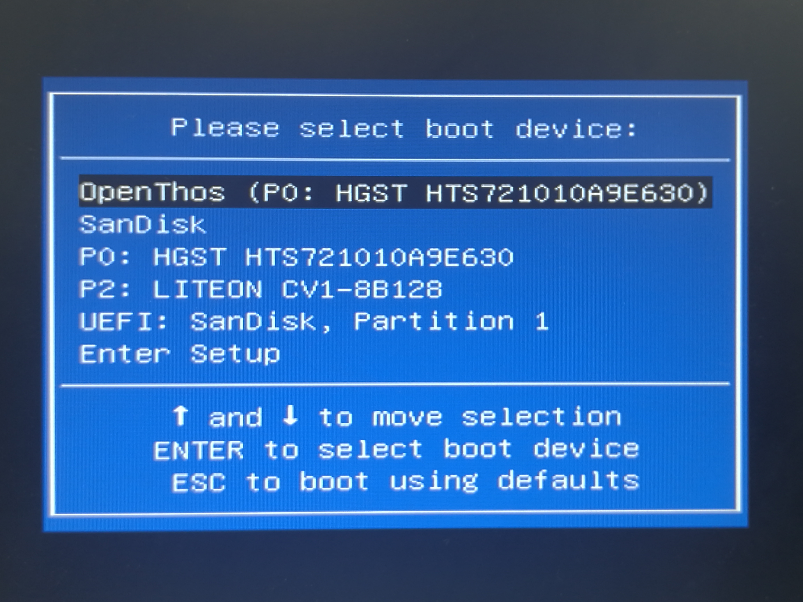

# 安装OPENTHOS  
与通常的基于Android的操作系统的安装过程相比,安装OPENTHOS是一件轻松而又惬意的事,因为OPENTHOS的安装并不复杂。  
您只需要制作一个OPENTHOS的启动U盘，然后从U盘上启动安装程序即可。  
当然，要安装使用OPENTHOS，您的计算机应满足如下的基本要求：  
* 基于Intel X86_64平台  
* Intel集显或核心显卡  
* 基于UEFI，并能按UEFI的模式启动操作系统
* 磁盘格式为GPT（不兼容MBR格式磁盘，手动安装时会自动将磁盘格式转为GPT，如果之前已经以MBR格式安装其它系统会无法启动）  
* 2GB以上的内存  
* 8GB以上的硬盘或SSD  
* 1920x1080或1366x768分辨率的显示器  
* 以太网络接口卡或是Wifi无线网卡  

别的X86_64平台有可能能够安装并使用OPENTHOS，但我们未进行过任何的官方测试，无法保证一定能够安装成功并正常使用。  
**另注：**  

*1. 同时对于以太网络接口卡及Wifi无线网卡，我们亦不能保证驱动全部型号的设备工作。我们会专门发布一个关于以太网络接口卡及Wifi无线网卡的兼容性列表。*  

*2. 如果您的计算机是基于传统BIOS，或是虽基于UEFI但不能按UEFI的方式启动操作系统，那么您将仅能通过下面的“Windows用户制作OPENTHOS启动U盘”一节的方法来制作一个OPENTHOS的U盘体验版本，来基于U盘来进行OPENTHOS的体验操作。此时您的用户数据存储空间将会受限在4GB以下，且没有图形化的启动引导环境。*  
<h2 id="1.1">OPNETHOS 镜像下载</h2>

- 方式一：访问[tuna清华大学开源软件镜像站](https://mirrors.tuna.tsinghua.edu.cn/openthos/)获取OPENTHOS镜像。
- 方式二：从我们百度网盘共享上下载OPENTHOS的U盘镜像文件。
```
网盘地址: http://pan.baidu.com/s/1kVauJ5t 
提取码: y48g
```

## 创建OPENTHOS启动U盘  
创建OPENTHOS启动U盘，共有分两种情况，分别是：在Windows环境下制作OPENTHOS启动U盘，和在Linux环境下制作启动U盘。  
这两种方法制作出来的U盘有些许的差异:  
* Windows版本制作出来的U盘体验版支持在传统BIOS下启动并体验OPENTHOS，但生成工具只支持8GB以上的U盘，且安装模式和体验模式是分别制作的。
* Linux版本的U盘，制作出来的可以通过开机时的选择来选择是安装还是体验，但Linux版本制作出来的U盘，仅能工作于UEFI环境。
### Windows用户制作OPENTHOS启动U盘   
要在Windows环境下制作OPENTHOS启动U盘，您可以使用UltraISO(软碟通)制作U盘启动盘，同时您的计算机还应满足以下条件：  
* 运行Windows 7、Windows 8.x或Windows 10操作系统中的一种。    
* 安装有4.0或是更高版本的.net framework.    
1. 下载UltraISO(软碟通)并安装     
2. [下载OPENTHOS镜像](#1.1)    
3. 制作U盘启动盘    
连接上U盘并运行UltraISO，找到已下载的img镜像，双击选中     



选择菜单栏中的"启动"，点击"写入硬盘映像…"     


查看硬盘驱动器和映像文件是否正确，然后点击"写入"
如果运行程序之前，您的U盘尚未连接到计算机上，您可以现在将其连接。一旦连接，相应的U盘将会出现可用的U盘列表中。



U盘中的所有数据会被清除



正在为您生成启动U盘


完成，现在可以使用系统的弹出U盘功能，弹出U盘。



接下来您可以使用刚刚生成的U盘安装或体验OPENTHOS操作系统。

### Linux用户制作OPENTHOS启动U盘  
理论上您可以使用任意一个Linux发行版来制作OPENTHOS启动U盘。但是我们建议您使用Ubuntu 16.04版本，这能保证本部分内容对您完全适用，而不会有发行版本差异带来的诸如设备路径等相关方面带来的困扰。   
1. [下载OPENTHOS镜像](#1.1)   
2. 制作OPENTHOS的安装U盘    
您可以使用命令行工具来完成U盘的制作，具体的命令如下：
```
sudo dd if=/your/oto_img/path of=/dev/sdx
例如:sudo dd if=/home/openthos/image/android_x86_64_oto.img of=/dev/sdc
```
如果不能确认U盘的设备路径，可以通过运行两次blkid命令的方式来确认U盘的设备文件。即在插上U盘之前运行一次"*sudo blkid | cut -f1 -d:*"，插上U盘后再运行一次"*sudo blkid | cut -f1 -d:*"，则第二次命令输出比第一次命令输出多出来的设备路径去掉最后的数字即是U盘的设备路径。  
如在我的电脑上，两次的输出分别是：  
```
/dev/sda1
/dev/sda2
/dev/sdb1
/dev/sdb5
```
和
```
/dev/sda1
/dev/sda2
/dev/sdb1
/dev/sdb5
/dev/sdc1
```
那么在我的电脑上U盘的设备路径就是“/dev/sdc”  
## 通过U盘来安装OPENTHOS   
**通常出现如下图标表示您的U盘系统已经制作成功.**

在启动的时候选择启动顺序,电脑的快捷键可能不同,我这
里是F10看到如下界面,并请选择你的UEFI U盘选项:

  

OPENTHOS有多种启动方式,可在U盘启动的图标下按F2键进入菜单，如下图所示:

  

  

- 1.OpenThos Live：无需安装即可启动,而且用户的数据可以保存在U盘上;  
要求:对U盘的安装要求比较高,否则容易出现卡顿现象  

- 2.OpenThos Live (DEBUG)：针对极客的一种模式,可以暂停系统的启动来观察系统行为  

- 3.OpenThos Installation：普通安装模式(**推荐**)

### 普通安装模式包括[自动安装](#2.1)和[手动安装](#2.2)，具体操作如下：

<h3 id="2.1">自动安装</h3>

如果你的电脑有一整块完整的硬盘或固态硬盘空闲,您可以选择自动安装模式<Auto Install>;  


<font color=red>*选择空闲的磁盘,请仔细确认!!!*</font>  


安装完成后系统会自动重启。
</br>
<h3 id="2.2">手动安装</h3>  

手动安装<Manual Install>方式适用范围  

```
1.同一块硬盘上安装双系统:OPENTHOS+windows,OPENTHOS+ubuntu  
2.对系统默认的分区size有其他需求的   
3.对linux分区有一定了解的爱好者  
```
- 1.为系统准备分区</br>
请您仔细看下面的介绍以避免对您的数据的破坏  
创建分区入口  

OPENTHOS下的分区是基于cgdisk来分区,它是一个基于光标的工具,用户可以使用上,下,左,右键和
最后分区的效果示例(仅适用于normal install模式):  

</br>
建议的分区大小可以如下表：

|大小   |文件系统格式|用途|
|:----:|:-----:|:----:|
| 200M| FAT32 |OPENTHOS EFI分区|
|4G|ext4|OPENTHOS system分区|
|40G|ext4|OPENTHOS data 分区|

- 2.开始安装</br>
 选择OpenThos Installation后在安装界面选择Manual Install

 

 依次选择曾经分好的3个分区，先选择EFI分区

 

 格式化EFI分区（**如果还有其它系统，且引导安装在该分区可以选择第一项不格式化**）

 
 
 

 选择system存放分区

 

 格式化

 

 选择data存放分区

 

 格式化

 

 OPENTHOS oto_img版本安装完成后系统会自动重启，选择相应的boot选项可进入openthos启动引导界面。

   

## 在虚拟机或模拟器中安装openthos   
请见[十八.在虚拟机或模拟器中安装openthos](十八.在虚拟机或模拟器中安装openthos.md)
