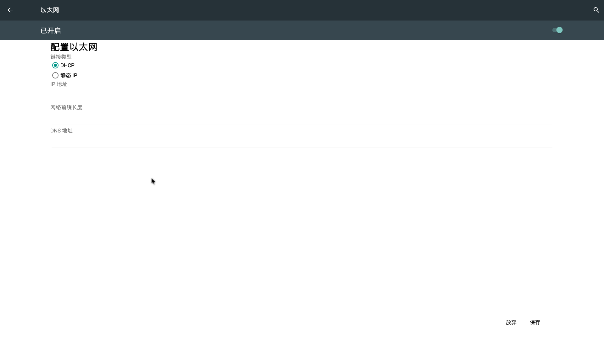
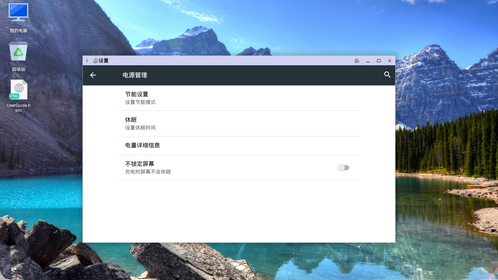
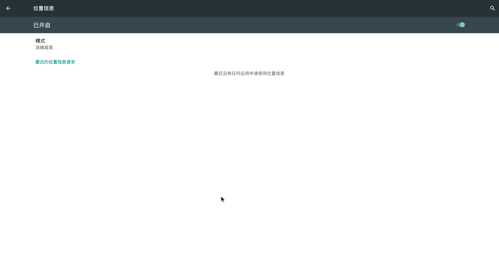
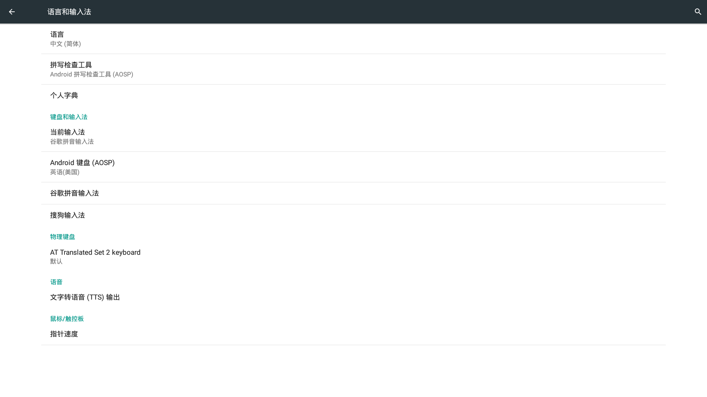
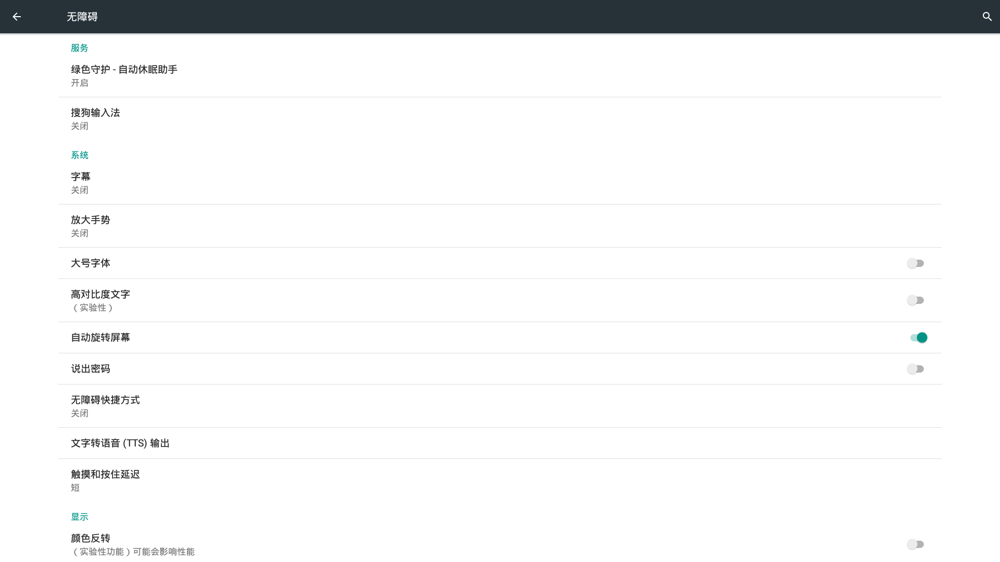
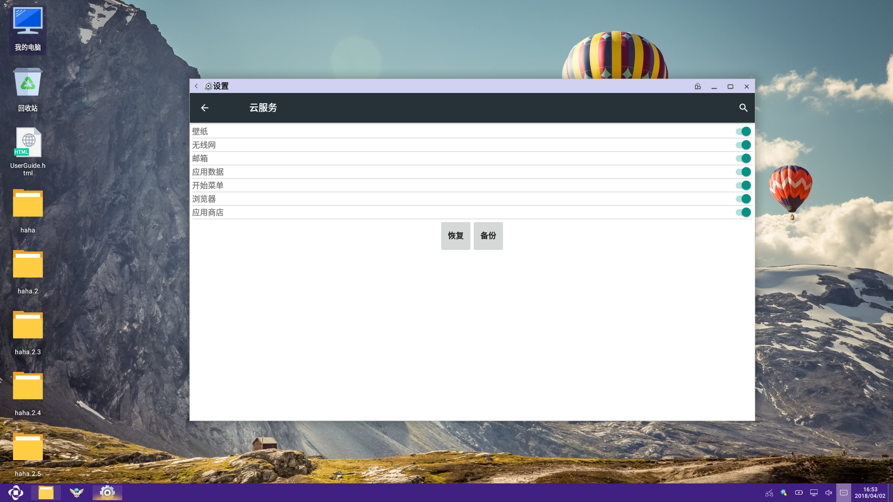

# 系统设置
展示图  

## 一. 无线和网络
   - WLAN  
 

      - 右上角 菜单键（三个点图标）
         - 添加网络 --（可通过手动输入SSID连入网络）
         - 刷新 --（刷新当前网络列表）
         - 高级 --（可设置屏蔽网络通知、随时扫描等高级操作）
   - 蓝牙  

      - 右上角 菜单键 （三个点图标）
         - 刷新 --（刷新可用设备列表）
         - 重命名此设备 --（为本机重新命名，连接其它设备时可在对方列表中显示此名称）
         - 显示收到的文件 --（打开蓝牙共享窗口，显示之前收到的所有文件）
     
   - 以太网  
        
      - 关闭/开启
      - 配置以太网
         - 链接类型
            - DHCP --（使用当前网络自动分配的地址，选中后其它设置项置灰，直接点击保存即可）
            - 静态IP --（用户手动设置ip地址，选中后其它设置项激活，完成所有配置项后才可以保存）
         - IP地址 --（输入ip地址，比如：192.168.0.123）
         - 网络前缀长度 --（输入网络前缀长度，一般为24）
         - DNS地址 --（输入DNS地址，一般为192.168.0.1）
         - 网关地址 --（输入网关地址，一般为192.168.0.1）
         - 放弃
         - 保存
   - 更多  

      - 飞行模式 --（暂不可用，如需禁用网络，可通过 通知栏->隔离模式 设置）
      - VPN --（暂不可用，如需VPN，可通过 开始菜单->影梭 设置）

## 二. 设备
   - 显示  

      - 亮度 --（调节笔记本屏幕亮度，台式机上设置无效）
      - 壁纸 --（设置桌面背景图片）
      - 字体大小 --（设置系统字体大小，可选择小、普通、大和超大）
      - 显示缩放 --（设置系统显示的DPI）
   - 提示音和通知  

      - 音量
         - 媒体音量
         - 闹钟音量
         - 通知音量
         - 默认通知铃声
         - 其他提示音
      - 通知
         - 应用通知 --（设置通知权限，可屏蔽通知或提高通知优先级)
         - 通知使用权 --（设置个别应用读取和使用其它应用通知的权限）
   - 电源管理  

      - 节能设置 --（暂不可用)
      - 休眠 --（设置电脑接通电源和用电池时，系统在多长时间后将进入休眠)
      - 电量详细信息 --（查看剩余电量统计数据）
         - 刷新 --（刷新电量统计图标）
         - 节电助手 --（打开后系统会通过降低性能、限制部分后台信息等手段延长电池续航时间）
      - 不锁定屏幕 --（开启后，电脑连接电源时将不会进入休眠）
     
   - 应用  

      - 已下载 --（点击列表中的应用后，进入该应用的应用信息界面，可进行查看信息、强制停止、卸载、清除数据等操作)
      - 正在运行 --（点击列表中的应用后，可停止该应用，报告按钮暂不可用)
         - 设备内存
         - 应用内存使用情况
         - 显示当前运行的服务
         - 显示缓存进程
      - 全部 --（点击列表中的应用后，进入该应用的应用信息界面，可进行查看信息、强制停止、卸载、清除数据等操作)
   
## 三. 个人
   - 位置信息 --（暂不可用)

      - 关闭/开启
      - 模式
         - 准确度高
         - 耗电量低
         - 仅限设备
      - 最近的位置信息请求 --（显示最近使用过位置信息功能的应用)
   -  安全  

      - 屏幕锁定方式
         - 无 --（锁屏时直接按回车键或电源键解锁)
         - 图案 --（画出特定的图案解锁)
            - 显示图案 --（设置解锁时是否显示划过的轨迹)
            - 自动锁定 --（请选择休眠立即后，其它选项暂不可用)
            - 电源按钮即时锁定 --（暂不可用)
      - 机主信息 --（设置锁屏界面上显示的文字)
      - 密码
         - 显示密码 --（设置系统中输入密码时是否短暂显示输入的字符)
      - 设备管理
         - 设备管理器 --（设置部分应用的安全权限)
         - 未知来源 --（开启后可直接安装下载的apk)
      - 凭据存储
         - 存储类型 --（仅限软件)
         - 信任的凭据 --（显示信任的CA证书)
         - 从SD卡安装 --（从SD卡安装证书)
         - 清除凭据 --（删除所有证书)
      - 高级
         - 信任的代理 --（暂不可用)
         - 屏幕固定 --（暂不可用)
         - 有权查看使用情况的应用 --（设置个别应用查看使用情况的权限)
   - 账户 --（显示当前系统中应用关联的账户，比如QQ、微信、邮箱账户等)

      - 添加账户 --（手动添加已有应用的账户)

   - 系统账户管理

      - openthos ID --（注册、绑定或解绑OpenthosID)

      - 主机用户名设置
         - 修改用户名
         - 修改锁屏密码
      - 主机名
   - 语言和输入法

      - 语言
      - 拼写检查工具 --（暂不可用)
      - 个人字典 --（暂不可用)
      - 键盘和输入法 --（如安装第三方输入法会显示在列表中)
         - 硬件 --（开启后输入文字时会显示软件盘)
         - Android键盘(AOSP)
         - 谷歌拼音输入法
         - 选择键盘
      - Android键盘(AOSP) --（原生输入法的详细设置)
      - 谷歌拼音输入法 --（谷歌输入法的详细设置)
      - AT Translated Set 2 keyboard --（设置键盘布局)
      - 文字转语音(TTS)输出
      - 指针速度 --（设置鼠标的移动速度)
   
## 四. 系统
   - 日期和时间  

      - 自动确定日期和时间
      - 自动确定时区
      - 设置日期
      - 设置时间
      - 选择时区
      - 使用24小时格式
   - 无障碍  

      - 任务管理器
      - 字幕
      - 放大手势
      - 大号字体
      - 高对比度文字
      - 自动旋转屏幕
      - 说出密码
      - 无障碍快捷方式
      - 文字转语音(TTS)输出
      - 触摸和按住延迟
      - 颜色反转
      - 色彩校正
   - 打印  
   打印操作请查看[常用功能](十一.系统升级.md)
   - 关于设备  

      - 系统重置 （使用此功能将清空系统所有设置，文件等)
      - 系统升级  
使用说明请见[十一.系统升级](https://github.com/openthos/userguide-analysis/blob/master/%E5%8D%81%E4%B8%80.%E7%B3%BB%E7%BB%9F%E5%8D%87%E7%BA%A7.md)
      - 法律信息
      - 型号
      - Android 版本
      - 内核版本
      - OpenGL driver version
      - OPENTHOS 1.1 rc1
      - CPU
      - 内存
      - 硬盘  
   - 云服务  
   

      - 云服务可备份系统的壁纸/无线网/邮箱/应用数据/开始菜单/浏览器/应用商店 的数据
      - 更换机器登录帐户，进入设置-云服务，点击恢复，可恢复以上数据
