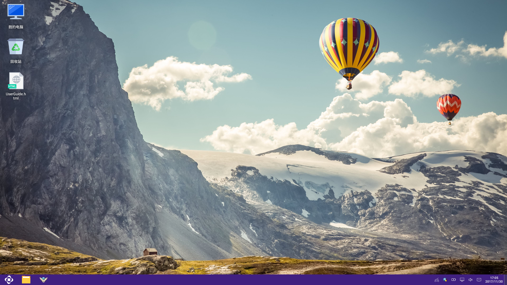

# 任务栏
   - 用于管理已打开的应用，也可设置键盘映射、输入法、网络、音量和时间，进入通知中心，最小化所有应用回到桌面。

任务栏效果图  

## 任务栏功能介绍
   - 在没有应用图标处，右键可以选择固定任务栏和自动隐藏任务栏。
   - 在应用图标处，单击鼠标右键，打开菜单
      - 打开应用(关闭应用)   (选中单击，打开/关闭应用)
      - 解除固定(固定到任务栏)   (选中单击，可解除固定/固定应用到任务栏)
      - 手机模式          (选中单击，以手机模式运行应用)
      - 桌面模式          (选中单击，以桌面模式运行应用)
   - 开始菜单     (鼠标左键／右键，打开开始菜单页面)
   - 文件管理器   (选中单击，打开文件管理器界面)
   - Internet浏览器      (选中单击，打开Internet浏览器界面)
   - [键盘映射](soft/键盘映射.md)
   - 输入法    (选中点击，直接打开输入法列表)
      - "√"表示当前正在使用的输入法
      - 切换输入法：直接点击想要切换的输入法，在弹出的列表中，点击想要切换的输入法，即可切换输入法
   - 电量      (选中点击，显示当前电池剩余电量百分比、剩余时间)
      - 设置节能模式    (点击打开设置界面，选择节能模式)
   - 网络      (选中点击，直接打开WiFi列表)
      - "√"表示当前连接的WiFi
      - 无线网已开启     (点击可打开/关闭WiFi)
      - 配置以太网       (点击打开有线网络设置界面，打开/关闭有线网络)
   - 音量           (选中点击，显示当前音量大小)
      - 点击喇叭图标，设置静音,再次点击，恢复音量
      - 上下拖动圆球可改变音量大小
   - 通知中心        (选中点击，打开通知中心界面)
   - 日历           (选中点击，显示时间、日期)
      - 点击“<“、“>“切换月份
      - 设置日期与时间     (打开"日期和时间"的设置界面)
   - 返回桌面
      - 鼠标左键 (选中点击,返回到桌面)
