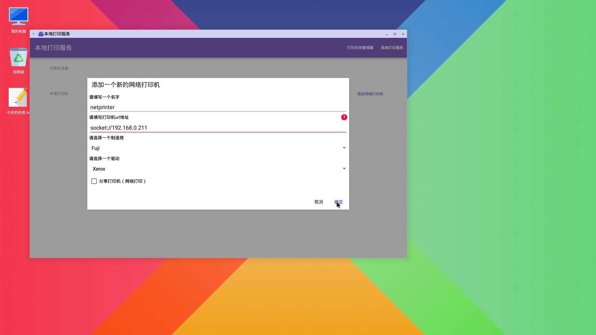
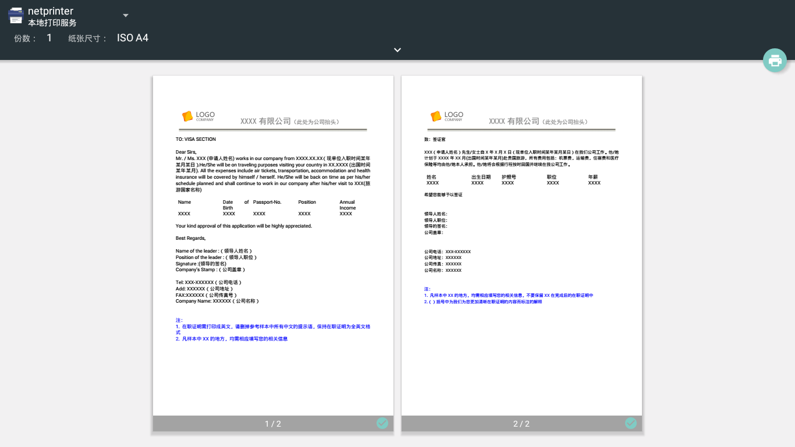
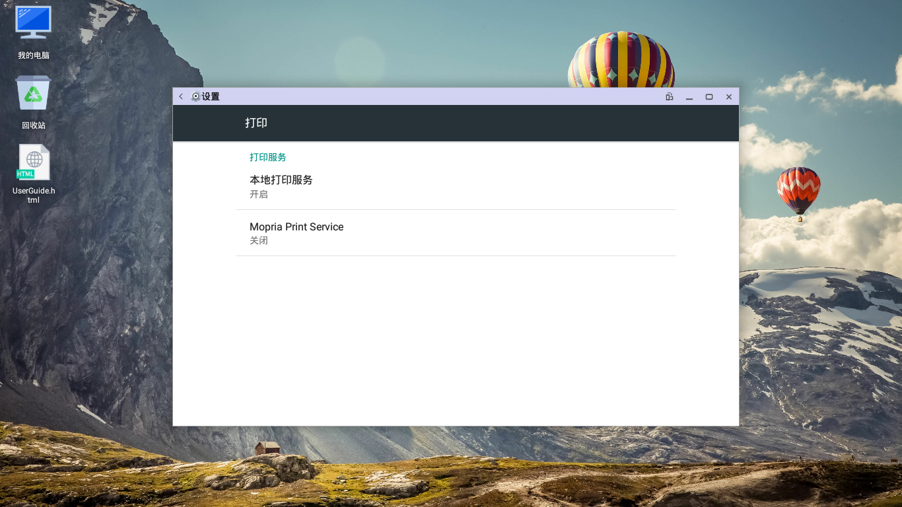
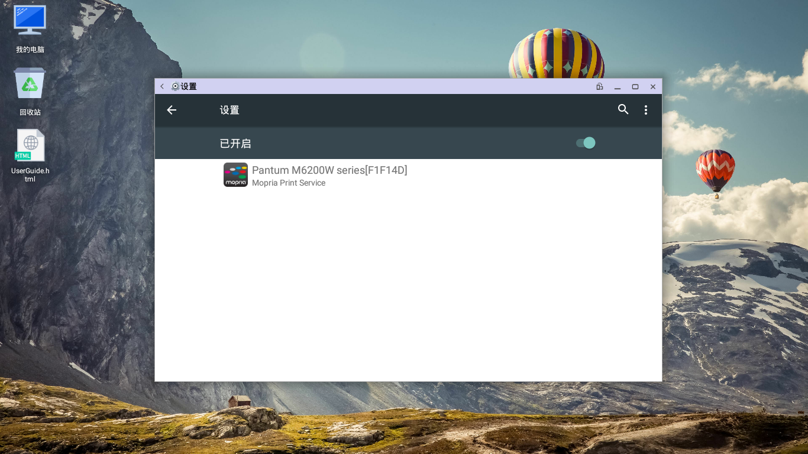
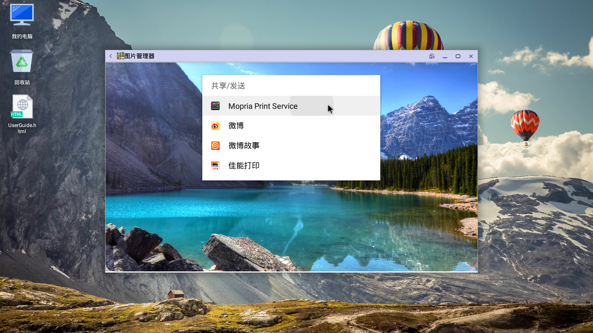
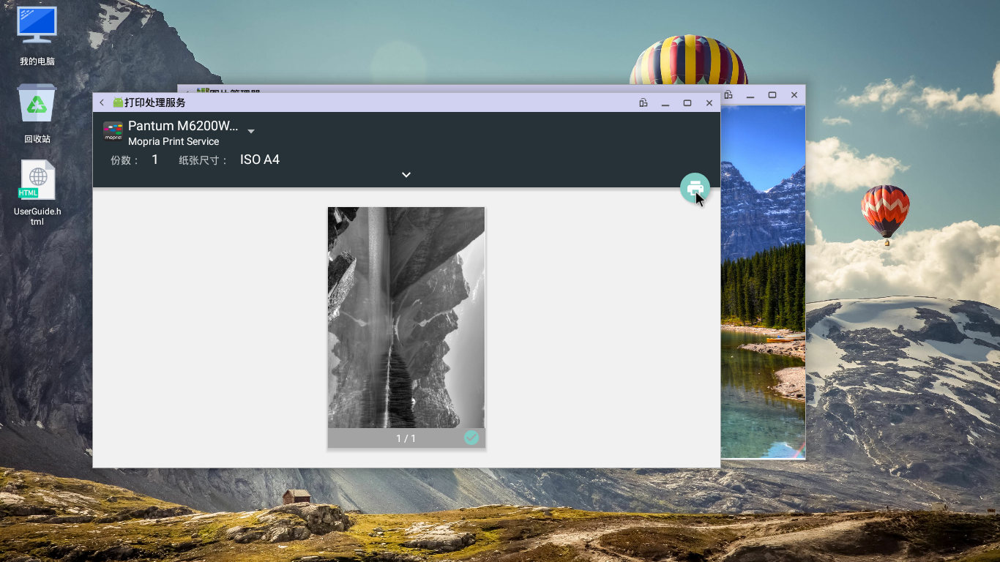

# 常用功能
  - 常用功能包括：     
    [通知栏](https://github.com/openthos/userguide-analysis/blob/master/%E5%8D%81.%E5%B8%B8%E7%94%A8%E5%8A%9F%E8%83%BD.md/#通知栏)     
    [打印](https://github.com/openthos/userguide-analysis/blob/master/%E5%8D%81.%E5%B8%B8%E7%94%A8%E5%8A%9F%E8%83%BD.md/#打印)     
    [投影](https://github.com/openthos/userguide-analysis/blob/master/%E5%8D%81.%E5%B8%B8%E7%94%A8%E5%8A%9F%E8%83%BD.md/#投影)     
   
## 通知栏
通知栏属于Openthos模块之一。它的加入使阁下对系统消息和应用消息的查看操作变得更加方便快捷

### 功能模块  
  - 通知管理 --（*屏蔽和优先*）
    - 点击通知管理：显示所有发送通知的应用，然后你点击列表中的应用，进行屏蔽操作和优先操作;
  - 清除所有 --（*清除通知*）
    - 点击清除所有：将所有显示的通知管理信息进行清除;
  - 通知消息 --（*显示应用*）
    - 点击一个通知消息，将显示该应用的界面;
  - 打印任务管理 --（*暂停和开始 取消打印*）
    - 点击打印任务管理： 将显示打印管理的列表，根据自己的需求进行操作;
  - 打印消息 --（*关闭*）
    - 点击右侧的错号：对正在进行的打印进行关闭;
  - 截屏 --（*截取全屏*）
    - 点击截屏：将截取整个屏幕;
  - 隔离模式  --（*切断连接*）
    - 点击隔离： 将切断有线网和无线网和蓝牙;
  - 投影 --（*模式选择*）
    - 选择投影样式;
  - 设置 --（*系统的设置*）
    - 点击设置： 进入设置的界面;

## 打印
打印属于Openthos模块之一。它的加入使阁下可以更方便的进行打印，使办工更便捷。
  - 目前可以通过三种方式连接打印机：   
    [本地打印服务](https://github.com/openthos/userguide-analysis/blob/master/%E5%8D%81.%E5%B8%B8%E7%94%A8%E5%8A%9F%E8%83%BD.md/#本地打印服务)    
    [Mopria Print Service](https://github.com/openthos/userguide-analysis/blob/master/%E5%8D%81.%E5%B8%B8%E7%94%A8%E5%8A%9F%E8%83%BD.md/#mopria-print-service)   
    [打印机官方app](https://github.com/openthos/userguide-analysis/blob/master/%E5%8D%81.%E5%B8%B8%E7%94%A8%E5%8A%9F%E8%83%BD.md/#打印机官方app)   
### 本地打印服务
#### 功能模块
  - 打印任务管理器 --（*暂停 开始 取消*）
    - 点击打印任务管理器： 对正在进行的打印任务实施暂停 开始 取消 操作。
  - 系统打印服务 --（*开启 关闭*）
    - 点击系统打印服务： 对本地打印服务进行关闭和开启。
  - 已添加设备
    - 点击已添加设备的条目： 
      - 显示已添加设备的信息：
        - 打印测试页：让打印机直接打印一张包含测试信息的页面
        - 微调：设置打印的Page Size(纸张大小) Paper Tray(纸位置) Paper type(纸类型) Double-Silded Printing(双面打印)
                Color Mode(颜色模式) Draft Mode(是否拉伸) Image Enhancement(是否图片增强)
  - 扫描打印机 --(*扫描本地打印设备*)
    - 点击扫描本地打印机：对本地打印机进行搜索。
  - 添加网络打印机 --(*网络打印*)
    - 点击添加网络设备：
      
      - 填写打印的名字：默认为netprinter.
      - 填写打印url地址：填写网络打印的地址，比如：socket://192.168.0.211
      - 请选择一个制造商：选择制造商，这里默认选择Fuji
      - 请选择一个驱动：针对不同的制造商选择不同的驱动，这里默认选择驱动Xerox
  - 实施打印
      - 打开要打印的文档或图片，比如在wps中打开一个文档
      - 进入当前应用的打印或分享功能，点击打印按钮，系统会弹出类似下图的对话框，选择系统打印服务         
         
      - 在新窗口左上角的下拉菜单中选择本地打印机，点击份数或纸张尺寸设置打印选项
，最后点击右上方的绿色打印图标开始打印。     
        

### Mopria Print Service
  - OPENTHOS 1.0 最终版预装了Mopria Print Service，如果您的打印机支持Mopria服务，可通过下面的方法连接打印机。    
    - 请先确保您的电脑和打印机连在同一个局域网内   
    - 进入设置－打印－系统打印服务（在打印界面右上角），进入Mopria Print Service   
         
    - 开启服务，系统会自动搜索网络中的打印机     
      如果没有搜索到，也可以点击mopria打印服务界面右上角的菜单按钮，选择添加打印机，手动输入打印机ip地址     
         
    - 打开要打印的内容，可以在打印或分享界面看到Mopria打印服务的选项
         
    - 进入该选项后，点击右边绿色打印按钮即可开始打印   
         
      
### 打印机官方app
  - OPENTHOS支持Canon等主流打印机厂家的官方app，您可以在应用商店或厂家官网下载安装包进行安装，具体操作请见打印机的说明书。   

## 投影  
### HDMI接口连接投影仪    
  - 用电脑的HDMI接口，连接投影仪，如果投影仪为VGA接口， 可以用HDMI-VGA转接线连接投影仪进行投影 （目前支持HDMI接口）。

### 投影方式选择：  
  - 点击右侧通知栏，点击投影，弹出窗口中在仅电脑，仅投影，和扩展中选择(未完成,目前仅支持克隆模式)。  
