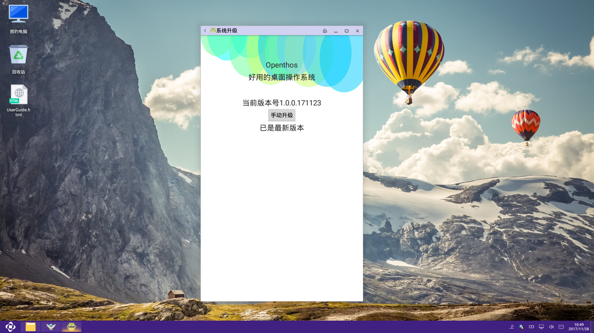
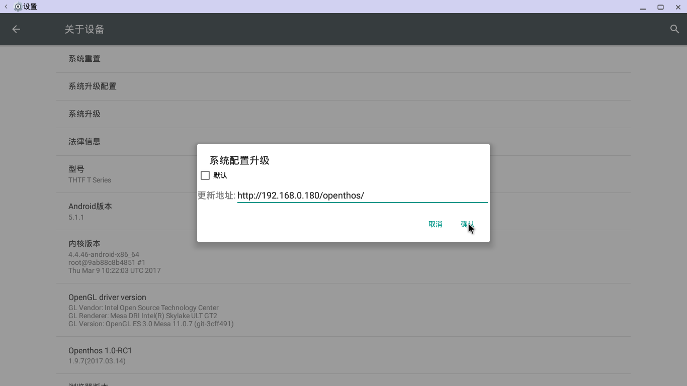

# 系统升级说明书
## 系统升级打开方式
进入系统升级有两种方式：
   - 应用列表里的“系统升级”为升级应用，可点击打开。
   - 设置-关于设备-系统升级。

## 系统升级方式
目前有两种系统升级方式：
   - [自动升级]()
   - [手动升级]()
### 自动升级
在当前有网络的情况下，可以按下面步骤进行自动升级
   - 进入系统升级页面，查看当前系统是稳定版还是开发版，如下图红框     
   
   - 进入开始菜单-设置-关于设备-系统升级配置，请根据上一步看到的版本类型填入相应的升级地址
      - 稳定版下载地址：https://mirrors.tuna.tsinghua.edu.cn/openthos/OTA/user/
      - 开发版下载地址：https://mirrors.tuna.tsinghua.edu.cn/openthos/OTA/dev/
           
      ```实验室内网下载地址：http://192.168.0.180/openthos/```
   - 回到系统升级界面，如果有新版本，界面上会有”发现新版本“、”新版本号“及”更新说明“按钮、”立即更新“按钮
      - 更新说明     
      点击可以查看系统更新内容     
   
      - 立即更新     
      点击下载新版本     
      
   - 新版本下载完毕后，系统会提示是否立即重启完成更新，点击”立即重启“     
      
   - 重启后，系统会自动完成更新。
### 手动升级
   - 进入系统升级界面，查看当前系统是稳定版还是开发版，如下图红框     
   
   - 下载openthos升级文件，目前有两个地址可供选择：
      - 清华大学开源软件镜像站     
      请根据上一步看到的版本类型下载相应的升级文件
         - 稳定版下载地址：https://mirrors.tuna.tsinghua.edu.cn/openthos/OTA/user/openthos_v1.0_user.zip.gpg
         - 开发版下载地址：https://mirrors.tuna.tsinghua.edu.cn/openthos/OTA/dev/openthos_v1.0_dev.zip.gpg
      - 百度网盘     
      http://pan.baidu.com/s/1kVauJ5t 提取码: y48g
         - 稳定版在user目录
         - 开发版在dev目录
   - 进入系统升级界面，点击手动升级
   - 进入文件管理器，选择之前下载的升级文件     
   
   - 手动升级风险提示，确认是否手动升级
           
   - 系统重启后完成手动升级


## 功能  
   - 查看当前系统版本
   - 查看当前版本是不是最新版本
   
   - 检测是否有新版本
   
      - 无网络情况 (系统显示当前版本，提示网络异常)
      - 有网络情况 (显示系统当前版本号、已是最新版本或显示发现新版本、新版本号及更新说明按钮、立即更新按钮)
   - 查看新版本的新功能
   
   - 下载系统新版本
   
   - 断点续传功能
   - 切换内外网下载功能
   
   
   - 手动升级
   - 完成升级包下载（弹出提示）
      - 提示（新版本升级包已下载完成，需重启系统完成升级，用户可选择稍后重启或立即重启）
         - 稍后重启（点击，提示用户稍后重启完成升级）
         - 立即重启（点击，重启系统，系统完成升级配置，完成升级）
   - 升级版本，使用新版本系统
   

