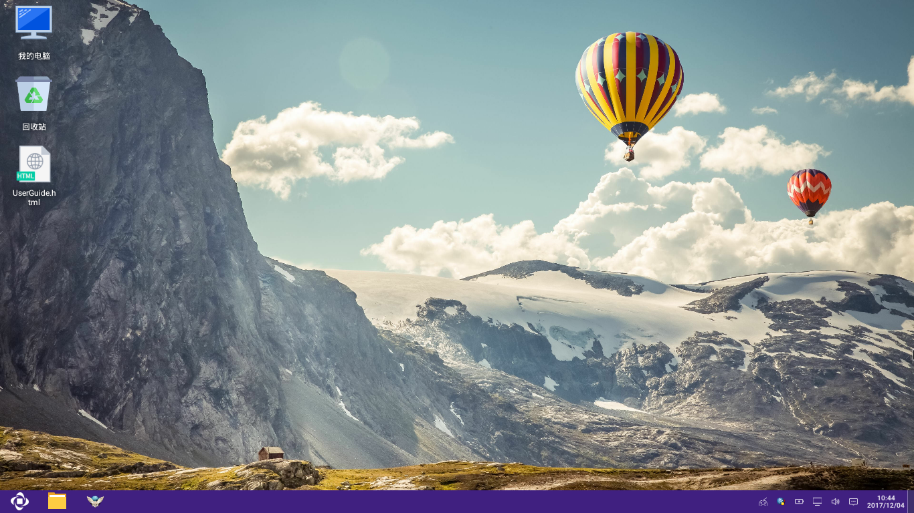
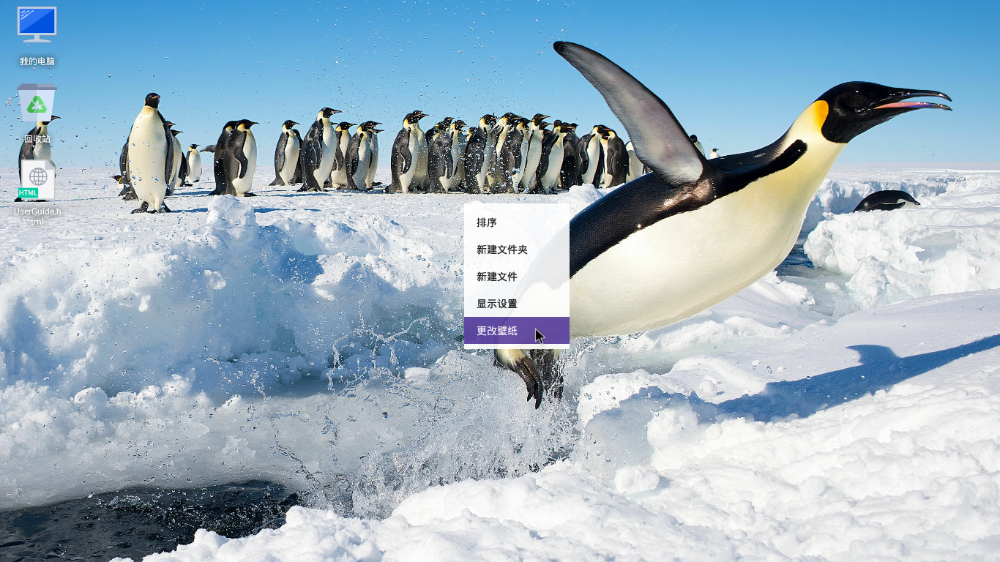
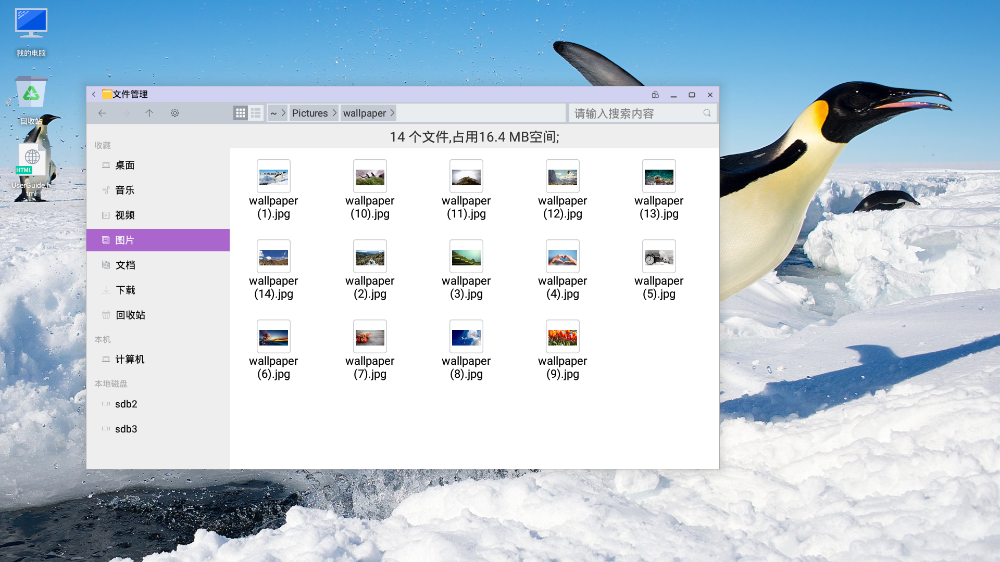
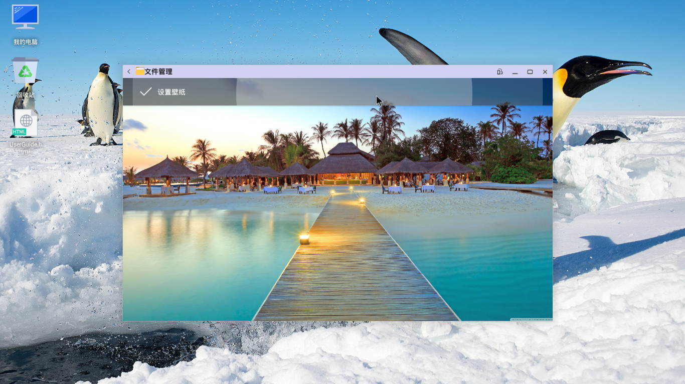
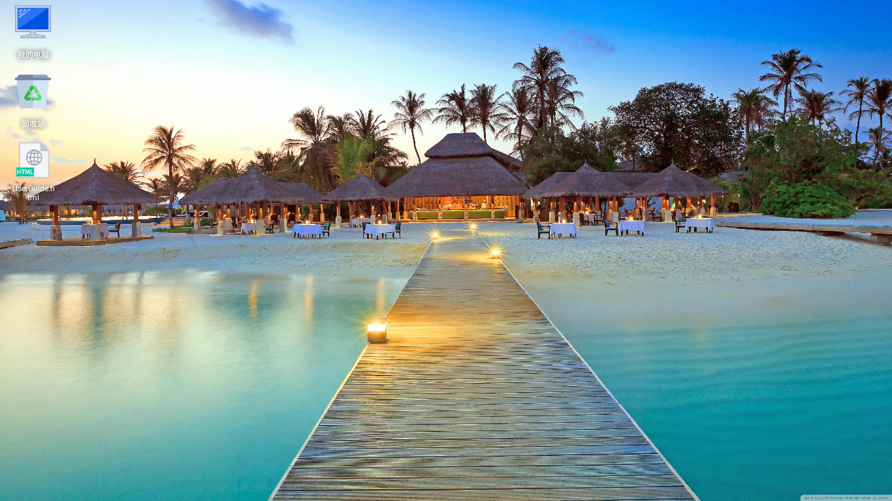

# 桌面
   
桌面效果图：  


## 基本组成
   - [开始菜单](./五.开始菜单.md)
   - [任务栏](./六.任务栏.md)
   - [通知栏](./七.通知栏.md)
   - 桌面壁纸
      - [更换壁纸](#更换壁纸)
   - 桌面图标
      - 图标是是具有可操作性的图形标识符号，根据不同的项目，分为不同的类型，Openthos中主要分为五类，每一类都有独自的选项菜单（右键触发）
         - [我的电脑](zhuomian/我的电脑.md )   通过我的电脑可以快速访问文件管理系统，是一个特殊的图标
         - [回收站](zhuomian/回收站.md )    用于存放用户删除的文件或文件夹（不包括U盘），当用户删除文件或文件夹，默认不会物理删除，而是转存到回收站统一管理。
         - [文件/文件夹](zhuomian/文件文件夹.md)   个人的文件或文件夹，快捷方便。
         - [空白区域](zhuomian/空白区域.md)    没有任何图标的区域
   - 图标的基本操作
      - 打开: 打开对应的内容，可以双击打开，右键打开
      - 更名: 给个人文件/文件夹重命名，可以右键选择重命名，也可以选中后按F2进行重命名
      - 删除: 删除个人文件/文件夹，可以右键选择删除，也可以选中后按delete删除到回收站，或者直接按Shift + Delete键可以快速呼出直接删除
      - 排列: 将桌面乱序的图标进行排序，恢复默认的顺序。可以邮件空白位置选择排序，也可以直接按F5来进行排序

## 桌面功能点
- 鼠标基本操作 
     - 支持 鼠标左键点选 选中文件反白
     - 支持 鼠标左键点空白位置，已选中的文件背景变透明
     - 支持 鼠标右键 弹出选项菜单
     - 支持 鼠标左键快速双击 打开指定的文件
     - 支持 快捷键"ctrl" + 鼠标左键点选 多个文件
     - 支持 按住Shift键,鼠标点击文件和文件夹,可选中第一次点击目标和最末次目标之间的所有目标
     - 支持 按住鼠标左键拖动,可框选多个文件
     - 支持 在任何界面，鼠标点击右下角可快速回到桌面
     
- 快捷键操作
     - 支持 快捷键"ctrl" + "a" 选择全部文件
     - 支持 快捷键"ctrl" + "c" 复制文件
     - 支持 快捷键"ctrl" + "v" 粘贴文件
     - 支持 快捷键"ctrl" + "x" 剪切文件
     - 支持 快捷键"F2" 快速重命名功能
     - 支持 快捷键"F5" 刷新桌面功能
     - 支持 快捷键"delete" 删除选中的文件到回收站功能
     - 支持 快捷键"shift" + "delete" 永久删除选中的文件
     - 支持 快捷键"Enter" 快速进入选中的条目
     - 支持 快捷键"Alt" + "Tab" 快速切换桌面和打开的应用
     - 支持 快捷键"Win" + "D" 快速切换到桌面
  
- 右键菜单
     - 支持 右键菜单 打开文件；
     - 支持 右键菜单 选择特定的应用来打开该文件（打开方式）
     - 支持 右键菜单 支持快速压缩选中的文件
     - 支持 右键菜单 支持快速解压缩选中的压缩包
     - 支持 右键菜单 支持复制选中的文件
     - 支持 右键菜单 支持剪贴选中的文件
     - 支持 右键菜单 支持删除选中的文件
     - 支持 右键菜单 支持重命名选中的文件
     - 支持 右键菜单 支持粘贴之前复制剪贴的文件
     - 支持 右键菜单 支持排序功能
     - 支持 右键菜单 支持查看选中文件的详情功能
     - 支持 右键菜单 支持新建文件夹
     - 支持 右键菜单 支持新建文件
     - 支持 右键菜单 支持跳转到显示设置界面
     - 支持 右键菜单 支持更改桌面壁纸
	 
- 显示
     - 支持 文件复制信息弹窗显示
     - 支持 文件剪贴信息弹窗显示
     - 支持 文件删除信息弹窗显示
     - 支持 文件压缩信息弹窗显示
     - 支持 文件解压缩信息弹窗显示
     - 支持 文件详情显示：文件位置，文件大小，创建时间，修改时间，访问时间，用户权限，群组权限，其他权限
     - 支持 根据不同的后缀显示不同的图标，表示不同的文件类型
     
## 功能说明
### 更换壁纸
   - 右键空白区域，选择更改壁纸  

   - 跳转到文件管理器的图片目录下,可以选择预装壁纸wallpaper，也可自主选择图片  

   - 选择一张合适的图片（最好与当前屏幕分辨率对应或成比例）  

   - 点击图片上方的设置壁纸按钮  
<br />  

### 我的电脑

   - 鼠标左键单击 --（反白）
   - 鼠标左键双击 --（打开文件管理器首页）
   - 鼠标右键 --（打开选项菜单）
      - 打开 --（打开文件管理器首页）
      - 关于本机 --（打开设置-关于设备）
### 回收站


   - 鼠标左键单击 --（反白）
   - 鼠标左键双击 --（打开文件管理器且显示回收站）
   - 鼠标右键 --（打开选项菜单）
      - 打开 --（打开文件管理器且显示回收站）
      - 清空回收站 --（将回收站内容全部删除）
### 文件夹/文件
   - 鼠标左键单击 --（反白）
   - 鼠标左键双击文件夹 --（打开文件管理器且显示相应的文件夹）
   - 鼠标左键双击文件 --（以系统已有的应用打开文件）
   - 鼠标右键 --（打开选项菜单）  


      - 打开
      - 打开方式 --（列出可打开该文件格式的应用）  

      - 压缩 --（弹出压缩格式选择窗口）  

    ```
    默认压缩为zip格式，文件可以压缩成zip、7z和tar三种格式，tar可以再次压缩成tar.gz和tar.bz2格式，zip格式不允许再次压缩
    ```
      - 解压缩 --（快速解压缩）  
也可以通过双击压缩包打开压缩软件的方式编辑和解压文件，具体操作请见[压缩软件](../soft/压缩软件.md)  

      - 剪切 --（将该文件记录，以便之后用于粘贴，支持去文件管理器粘贴）
      - 复制 --（将该文件记录，以便之后用于粘贴，支持去文件管理器粘贴）
      - 删除 --（弹出删除到回收站的弹窗）
         - 是 --（删除该文件到回收站）
         - 否 --（取消该操作）
      - 重命名 --（文件名获得焦点，可以输入文字，按回车键或者点击桌面其他位置确定重命名）
    ```
    如果不能重命名，可能是因为有应用在前台可见，需要点击右下角回到桌面或者直接win+d回到桌面后点击方可生效
    ```
      - 属性 --（弹出属性弹窗）
         - 文件类型 --（显示文件类型，暂不支持）
         - 打开方式 --（显示打开方式，暂不支持）
         - 位置 --（显示文件的绝对路径）
         - 大小 --（显示文件的大小）
         - 创建时间 --（显示文件的创建时间）
         - 修改时间 --（显示文件的修改时间）
         - 访问时间 --（显示文件的访问时间）
         - 用户权限 --（显示文件的用户权限）
         - 群组权限 --（显示文件的群组权限）
         - 其他权限 --（显示文件的其他权限）
         - 确定 --（关闭该弹窗）
         - 取消 --（关闭该弹窗）
         - 应用 --（关闭该弹窗）
### 空白处


   - 鼠标左键--（反白已选中的图标）
   - 鼠标右键--（打开选项菜单）
      - 粘贴--（将之前剪贴或复制的内容粘贴到桌面，支持从文件管理器剪贴或复制）
      - 排序--（将桌面图标排序）
      - 新建文件夹--（在桌面快速新建文件夹）
      - 显示设置--（快速打开设置--显示）  

      - 更改壁纸--（快速打开设置--壁纸选择）
